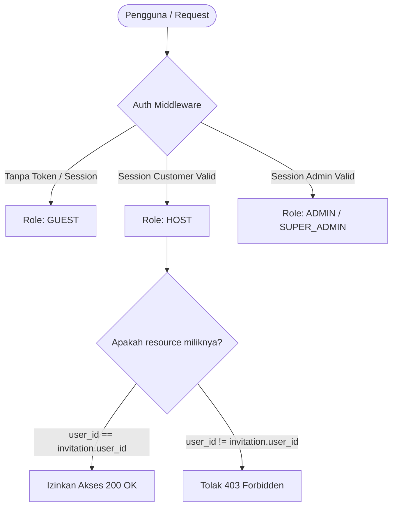
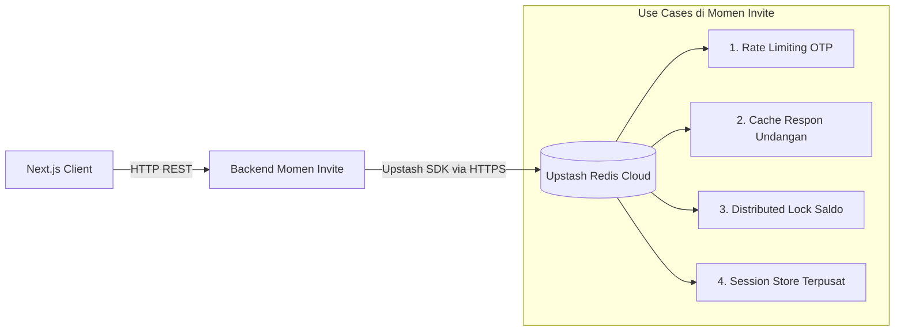
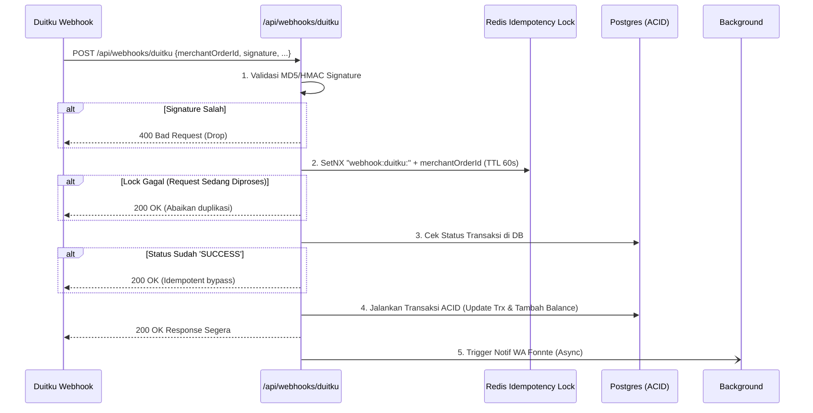
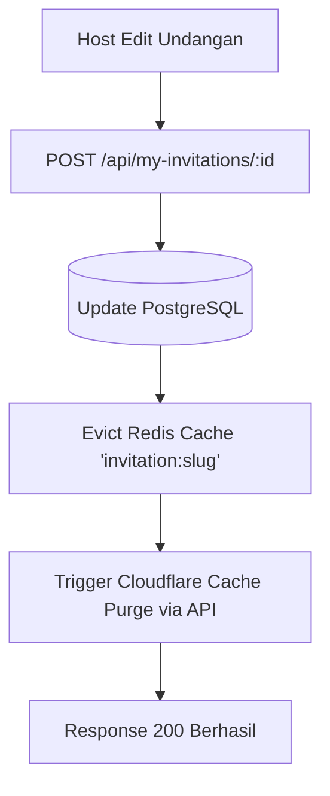
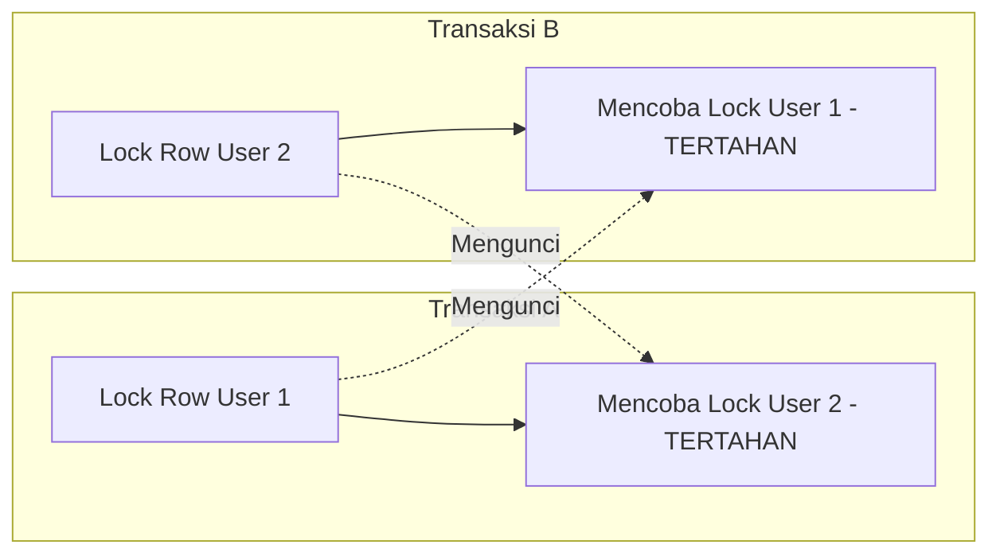
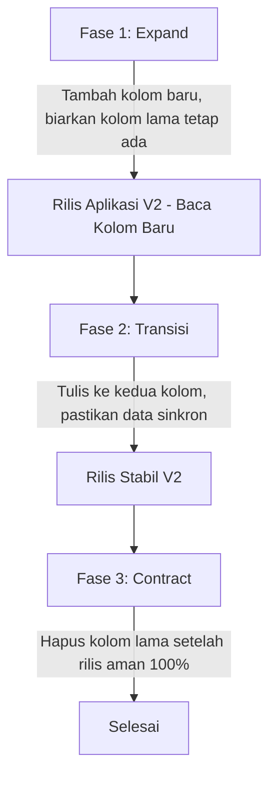

# Panduan Fundamental Arsitektur, Resiliensi Sistem, & Mitigasi Kegagalan: Momen Invite

**Versi Dokumen:** 1.0  
**Tanggal:** 27 Agustus 2026  
**Status:** Dokumen Rekayasa Keandalan Sistem (*Site Reliability & Engineering Standards*)  
**Lokasi File:** `backend-momeninvite/docs/fundamental.md`

---

## Daftar Isi

1. [Ringkasan & Filosofi Desain](#1-ringkasan--filosofi-desain)
2. [Pilar Arsitektur & Komponen Infrastruktur Modern](#2-pilar-arsitektur--komponen-infrastruktur-modern)
   - 2.1 [RBAC (Role-Based Access Control)](#21-rbac-role-based-access-control)
   - 2.2 [setIndex & Strategi Database Indexing](#22-setindex--strategi-database-indexing)
   - 2.3 [Upstash Redis (Serverless Caching, Rate Limiting & Queue)](#23-upstash-redis)
   - 2.4 [Elasticsearch (Enterprise Search & Log Analytics)](#24-elasticsearch)
3. [Mitigasi Skenario Kegagalan Integrasi, API, & Jaringan](#3-mitigasi-skenario-kegagalan-integrasi-api--jaringan)
   - 3.1 [Webhook Error](#31-webhook-error)
   - 3.2 [Push Notif Gagal](#32-push-notif-gagal)
   - 3.3 [External API Timeout](#33-external-api-timeout)
   - 3.4 [CORS Ngamuk (Cross-Origin Resource Sharing Issues)](#34-cors-ngamuk)
   - 3.5 [JWT Invalid](#35-jwt-invalid)
   - 3.6 [Session Logout Sendiri](#36-session-logout-sendiri)
   - 3.7 [Cookie Gak Ke-set](#37-cookie-gak-ke-set)
4. [Mitigasi Masalah Cache, Antrean (Queue), & Worker](#4-mitigasi-masalah-cache-antrean-queue--worker)
   - 4.1 [Cache Basi (Stale Cache)](#41-cache-basi-stale-cache)
   - 4.2 [Redis Down](#42-redis-down)
   - 4.3 [Queue Stuck (Antrean Macet)](#43-queue-stuck-antrean-macet)
   - 4.4 [Worker Mati (Process Crash / OOM)](#44-worker-mati)
   - 4.5 [Cronjob Gak Jalan](#45-cronjob-gak-jalan)
5. [Mitigasi Masalah Database & Query Performance](#5-mitigasi-masalah-database--query-performance)
   - 5.1 [Duplicate Data](#51-duplicate-data)
   - 5.2 [DB Timeout](#52-db-timeout)
   - 5.3 [N+1 Query Problem](#53-n1-query-problem)
   - 5.4 [Deadlock Database](#54-deadlock-database)
6. [Mitigasi Bug Logika Kode, Memory, & Runtime](#6-mitigasi-bug-logika-kode-memory--runtime)
   - 6.1 [Memory Leak](#61-memory-leak)
   - 6.2 [Null Pointer / TypeError: Cannot read property of undefined](#62-null-pointer--typeerror)
   - 6.3 [Infinite Loop](#63-infinite-loop)
   - 6.4 [Page Render Salah Implementasi (Hydration & Waterfall)](#64-page-render-salah-implementasi)
7. [Mitigasi Kegagalan Migrasi, Database Evolution, & DevOps](#7-mitigasi-kegagalan-migrasi-database-evolution--devops)
   - 7.1 [Migration Lupa](#71-migration-lupa)
   - 7.2 [Rollback Gagal](#72-rollback-gagal)
8. [Mitigasi Masalah Jaringan Publik: DNS, SSL, Redirect, & CDN](#8-mitigasi-masalah-jaringan-publik-dns-ssl-redirect--cdn)
   - 8.1 [DNS Drama](#81-dns-drama)
   - 8.2 [SSL Expired](#82-ssl-expired)
   - 8.3 [Redirect Loop](#83-redirect-loop)
   - 8.4 [CDN Gak Update](#84-cdn-gak-update)
9. [Production Readiness & Incident Response Checklist](#9-production-readiness--incident-response-checklist)

---

## 1. Ringkasan & Filosofi Desain

Platform SaaS undangan digital seperti **Momen Invite** memiliki karakteristik beban ganda:
1. **Lonjakan Lalu Lintas Publik Masif (*Traffic Spikes*):** Pada hari H acara (misal: Sabtu & Minggu), ribuan tamu mengakses URL undangan secara bersamaan, membuka galeri foto, melihat peta lokasi, mengisi buku tamu, dan mentransfer kado uang melalui QRIS/E-Wallet.
2. **Integritas Finansial Tinggi (*Strict Financial Consistency*):** Fitur amplop digital dan saldo dompet (*wallet*) menuntut jaminan konsistensi ACID 100%. Kesalahan logika mutasi, kegagalan webhook, atau *race condition* dapat menyebabkan kerugian finansial riil bagi pengantin atau platform.

Dokumen ini membedah konsep modern dan merumuskan strategi penanganan insiden (*defensive engineering*) di lapisan **Backend** dan **Frontend**.

---

## 2. Pilar Arsitektur & Komponen Infrastruktur Modern

### 2.1. RBAC (Role-Based Access Control)

#### Konsep:
RBAC adalah metode pembatasan otorisasi sistem berdasarkan peran pengguna (*role*). Di Momen Invite, terdapat 4 peran utama:
- **`GUEST` (Tamu Publik):** Tanpa login. Izin: Lihat undangan (`read:invitation:public`), submit RSVP (`create:rsvp`), isi ucapan (`create:wish`), kirim amplop digital (`create:gift`).
- **`HOST` (Klien / Pemilik Acara):** Login via OTP email. Izin: CRUD undangan miliknya (`manage:my_invitation`), kelola daftar tamu (`manage:my_guests`), lihat buku tamu & RSVP miliknya, lihat saldo wallet (`read:my_balance`), ajukan penarikan dana (`create:withdrawal`).
- **`ADMIN` (Staff Operasional):** Login email + password. Izin: Tinjau order paket (`manage:orders`), audit konten & template (`manage:templates`), moderasi pesan kontak.
- **`SUPER_ADMIN` (Pemilik Platform):** Izin penuh: Approve/reject pencairan dana (`approve:withdrawal`), kelola master paket (`manage:pricing`), kelola rekening bank penampung (`manage:bank_settings`).



#### Penerapan Backend:
1. Simpan peran pengguna di tabel atau token/sesi (`req.session.role = 'host' | 'admin' | 'superadmin'`).
2. Buat middleware otorisasi modular:
   ```typescript
   export const authorize = (requiredRoles: string[], permissionCheck?: (req: Request) => Promise<boolean>) => {
     return async (req: Request, res: Response, next: NextFunction) => {
       if (!req.session?.role || !requiredRoles.includes(req.session.role)) {
         return res.status(403).json({ error: "FORBIDDEN_ROLE", message: "Akses ditolak untuk peran Anda." });
       }
       if (permissionCheck) {
         const hasPermission = await permissionCheck(req);
         if (!hasPermission) {
           return res.status(403).json({ error: "FORBIDDEN_RESOURCE", message: "Anda bukan pemilik resource ini." });
         }
       }
       next();
     };
   };
   ```

#### Penerapan Frontend:
1. Buat Higher-Order Component / Guard Layout di Next.js: `<RoleGuard roles={['host']}>` atau `<AdminGuard>`.
2. Jangan tampilkan menu atau tombol aksi (misal: tombol "Tarik Saldo" atau "Admin Panel") jika peran user tidak mencukupi, namun **ingat bahwa otorisasi sejati tetap berada di backend**.

---

### 2.2. setIndex & Strategi Database Indexing

#### Konsep:
Indexing membuat struktur data terurut (umumnya B-Tree) di disk database sehingga proses pencarian `WHERE`, pengurutan `ORDER BY`, dan penggabungan `JOIN` tidak perlu melakukan *Full Table Scan*.

#### Kasus di Momen Invite:
1. Pencarian slug undangan: `SELECT * FROM invitations WHERE slug = 'budi-ani'`.
2. Pencarian kode tamu check-in: `SELECT * FROM guests WHERE guest_code = 'VIP-001'`.
3. Filter transaksi per user & status: `SELECT * FROM transactions WHERE user_id = 12 AND payment_status = 'SUCCESS'`.

#### Penerapan Backend (Drizzle ORM Indexing):
Di `shared/schema.pg.ts`:
```typescript
import { index, uniqueIndex } from "drizzle-orm/pg-core";

export const invitations = pgTable("invitations", {
  id: serial("id").primaryKey(),
  slug: varchar("slug", { length: 120 }).notNull(),
  userId: integer("user_id"),
  isPublished: boolean("is_published").default(true),
  // kolom lainnya...
}, (table) => ({
  slugIdx: uniqueIndex("idx_invitations_slug").on(table.slug),
  userPublishedIdx: index("idx_invitations_user_published").on(table.userId, table.isPublished), // Composite Index
}));

export const transactions = pgTable("transactions", {
  id: serial("id").primaryKey(),
  userId: integer("user_id").notNull(),
  invitationId: integer("invitation_id").notNull(),
  paymentStatus: text("payment_status").notNull(),
  createdAt: timestamp("created_at").default(sql`NOW()`),
}, (table) => ({
  userStatusIdx: index("idx_trx_user_status").on(table.userId, table.paymentStatus),
  invitationIdx: index("idx_trx_invitation").on(table.invitationId),
}));
```

#### Aturan Emas Indexing:
- **Jangan mengindeks sembarang kolom:** Setiap index mempercepat `SELECT`, tetapi memperlambat `INSERT`, `UPDATE`, dan `DELETE` karena database harus memperbarui struktur pohon B-Tree pada setiap mutasi.
- **Kardinalitas Tinggi:** Utamakan kolom dengan variasi nilai tinggi (`slug`, `email`, `guest_code`). Kolom dengan variasi rendah (`boolean`, gender) tidak efisien diindeks sendirian kecuali digabung dalam *Composite Index* atau *Partial Index*.

---

### 2.3. Upstash Redis

#### Konsep:
Upstash adalah Serverless Redis berbasis protokol HTTP/REST yang dirancang khusus untuk arsitektur cloud, serverless (Next.js/Vercel/cPanel), dan edge runtime. Upstash menyelesaikan masalah kehabisan koneksi TCP (*connection pooling exhaustion*) karena menggunakan HTTP stateless.



#### Penerapan Backend:
1. **Instalasi:** `npm install @upstash/redis @upstash/ratelimit`
2. **Rate Limiter OTP (Pencegahan Spammer):**
   ```typescript
   import { Redis } from "@upstash/redis";
   import { Ratelimit } from "@upstash/ratelimit";

   const redis = new Redis({
     url: process.env.UPSTASH_REDIS_REST_URL!,
     token: process.env.UPSTASH_REDIS_REST_TOKEN!,
   });

   // Maksimal 5 permintaan OTP per 10 menit per IP / Email
   export const otpRateLimiter = new Ratelimit({
     redis,
     limiter: Ratelimit.slidingWindow(5, "10 m"),
     analytics: true,
     prefix: "ratelimit:otp",
   });

   export async function checkOtpLimit(identifier: string) {
     const { success, limit, remaining, reset } = await otpRateLimiter.limit(identifier);
     return { allowed: success, remaining, resetTime: reset };
   }
   ```
3. **Distributed Locking untuk Transaksi Saldo (Redlock Pattern):**
   Mencegah dua request mutasi saldo pada host yang sama berjalan bersamaan:
   ```typescript
   export async function acquireLock(lockKey: string, ttlMs = 5000): Promise<boolean> {
     const result = await redis.set(lockKey, "LOCKED", { nx: true, px: ttlMs });
     return result === "OK";
   }

   export async function releaseLock(lockKey: string) {
     await redis.del(lockKey);
   }
   ```

---

### 2.4. Elasticsearch

#### Konsep:
Elasticsearch adalah search engine terdistribusi berbasis Apache Lucene yang melakukan tokenisasi teks (*inverted index*), analisis semantik kata, koreksi saltik (*fuzzy search*), dan pencarian *full-text* sub-detik pada jutaan data.

#### Kasus Penggunaan di Momen Invite:
1. **Pencarian Tamu Acara Akbar (Mega Wedding 5.000+ Tamu):** Saat penerima tamu mencari nama "Dr. Hj. Siti Nurhaliza, M.Pd" di meja penerima tamu, pencarian SQL `LIKE '%Siti%'` lambat dan tidak fleksibel terhadap saltik.
2. **Pencarian Master Template & Katalog Desain:** Menemukan template berdasarkan kata kunci nuansa seperti "rustic", "pastel", "adat jawa modern".
3. **Audit Log Transaksi:** Mengagregasi log mutasi pembayaran dan riwayat webhook.

#### Penerapan Praktis di Ekosistem Momen Invite:
- Untuk tahap awal (Fase 1-2), PostgreSQL Full-Text Search (`tsvector` & `tsquery` dengan index `GIN`) sudah sangat mumpuni tanpa perlu menambah kompleksitas operasional cluster Elasticsearch.
- Saat masuk ke Fase Skala Besar (Fase 3+): Gunakan service Elasticsearch atau OpenSearch terkelola. Sinkronisasi data dari PostgreSQL ke Elasticsearch dilakukan menggunakan pola *Change Data Capture* (CDC) via Debezium atau worker antrean event.

---

## 3. Mitigasi Skenario Kegagalan Integrasi, API, & Jaringan

### 3.1. Webhook Error

#### Konsep & Masalah:
Payment Gateway (Duitku) mengirimkan notifikasi HTTP POST saat tamu selesai membayar amplop atau host membayar paket. Masalah umum:
- Webhook ditembak berulang-ulang (*duplicate webhook / network retry*).
- Hacker menembak endpoint webhook palsu tanpa bayar (*fake webhook injection*).
- Server kita lambat memproses dan mengembalikan status selain 200, sehingga PG menganggap gagal lalu me-retry terus menerus.

#### Mitigasi di Backend:


1. **Verifikasi Signature Wajib:**
   Hitung hash (misal: `MD5(merchantCode + amount + merchantOrderId + apiKey)`) dan cocokkan dengan signature header/payload dari Duitku sebelum memproses apapun.
2. **Kunci Idempotensi (*Idempotency Key*):**
   Gunakan nomor order unik sebagai kunci di Redis atau cek kolom `transactions.payment_status`. Jika status sudah `SUCCESS`, langsung balas `200 OK` tanpa menambah saldo lagi!
3. **Pisahkan I/O Berat ke Background:**
   Jangan mengirim pesan WhatsApp atau Email di dalam siklus request webhook Duitku. Cukup selesaikan transaksi database, kembalikan respon HTTP `200 OK` dalam $< 1$ detik, lalu lempar event kirim WA ke antrean background.

---

### 3.2. Push Notif Gagal

#### Konsep & Masalah:
Notifikasi WhatsApp (Fonnte) atau Web Push gagal terkirim karena server Fonnte *down*, kuota nomor bot habis, atau nomor WhatsApp tujuan tidak valid.

#### Mitigasi:
- **Backend:**
  1. Bungkus pemanggilan API notifikasi dalam antrean (*queue*) dengan mekanisme *Exponential Backoff Retry* (coba ulang setelah 1 detik, 5 detik, 30 detik).
  2. Batasi retry maksimal 3 kali. Jika tetap gagal, pindahkan pesan ke tabel `dead_notifications` atau log audit untuk inspeksi manual.
  3. **Multi-Channel Fallback:** Jika WhatsApp Fonnte mengembalikan error 5xx, sistem otomatis mengalihkan notifikasi penting (seperti OTP login) ke jalur Email via Resend.
- **Frontend:**
  Gunakan *Optimistic UI* dengan feedback yang jujur: Tampilkan toast *"Kado berhasil dikirimkan. Notifikasi sedang diantrekan ke WhatsApp pengantin."*

---

### 3.3. External API Timeout

#### Konsep & Masalah:
Saat backend memanggil Duitku, Resend, Fonnte, atau Cloudflare R2, pihak ketiga mengalami *high load* sehingga koneksi HTTP menggantung (*hanging*). Hal ini dapat menghabiskan thread pool backend Node.js dan menyebabkan seluruh aplikasi lumpuh.

#### Mitigasi:
1. **Pasang AbortSignal & Strict Timeout:**
   Jangan pernah menggunakan `fetch()` tanpa batas waktu timeout!
   ```typescript
   export async function fetchWithTimeout(url: string, options: RequestInit, timeoutMs = 8000) {
     const controller = new AbortController();
     const timer = setTimeout(() => controller.abort(), timeoutMs);
     try {
       const response = await fetch(url, { ...options, signal: controller.signal });
       return response;
     } catch (error: any) {
       if (error.name === "AbortError") {
         throw new Error(`EXTERNAL_API_TIMEOUT: Permintaan ke ${url} melebihi ${timeoutMs}ms.`);
       }
       throw error;
     } finally {
       clearTimeout(timer);
     }
   }
   ```
2. **Circuit Breaker Pattern:**
   Jika external service gagal berturut-turut sebanyak 5 kali, buka sirkuit (*open circuit*) selama 30 detik sehingga request berikutnya langsung gagal seketika (*fail-fast*) tanpa menunggu timeout berulang-ulang.

---

### 3.4. CORS Ngamuk (Cross-Origin Resource Sharing Issues)

#### Konsep & Masalah:
Browser memblokir request AJAX/Fetch dari frontend (`https://momeninvite.com`) ke backend API (`https://api.momeninvite.com`) karena header `Access-Control-Allow-Origin` tidak ada, tidak cocok, atau preflight `OPTIONS` ditolak.

#### Mitigasi:
- **Backend (Express):**
  Konfigurasi package `cors` secara presisi, dukung kredensial (*cookies*), dan tangani preflight request:
  ```typescript
  import cors from "cors";

  const allowedOrigins = [
    "http://localhost:3000",
    "http://localhost:5000",
    "https://momeninvite.com",
    "https://www.momeninvite.com",
  ];

  app.use(cors({
    origin: (origin, callback) => {
      // Izinkan tool seperti Postman/mobile app (origin undefined) atau origin terdaftar
      if (!origin || allowedOrigins.includes(origin)) {
        callback(null, true);
      } else {
        callback(new Error("CORS_POLICY_VIOLATION: Origin tidak diizinkan."));
      }
    },
    credentials: true, // Wajib true agar cookie sesi dapat dikirimkan lintas domain
    methods: ["GET", "POST", "PUT", "PATCH", "DELETE", "OPTIONS"],
    allowedHeaders: ["Content-Type", "Authorization", "X-Requested-With"],
    maxAge: 86400, // Cache preflight OPTIONS selama 24 jam agar browser tidak mengirim request berlebih
  }));
  ```
- **Frontend:**
  Pastikan setiap pemanggilan `fetch` atau Axios menyertakan flag kredensial:
  `fetch(url, { credentials: "include" })`.

---

### 3.5. JWT Invalid

#### Konsep & Masalah:
Token JWT ditolak karena:
- Token telah kedaluwarsa (*TokenExpiredError*).
- Secret key di server berubah atau di-*restart*.
- Format header salah (bukan `Bearer <token>`).
- Perbedaan waktu jam server (*clock skew*).

#### Mitigasi:
- **Backend:**
  1. Pasang *clock tolerance* (leeway) minimal 5-10 detik saat verifikasi JWT untuk mengakomodasi jeda NTP server:
     `jwt.verify(token, SECRET, { clockTolerance: 10 })`.
  2. Pisahkan token menjadi **Access Token (umur pendek, misal 15 menit)** dan **Refresh Token (umur panjang, misal 7 hari)** yang disimpan pada `httpOnly` cookie.
  3. Kembalikan kode error spesifik: `TOKEN_EXPIRED` vs `INVALID_TOKEN` agar client tahu kapan harus meminta refresh token.
- **Frontend:**
  Pasang Axios/Fetch Interceptor. Saat mendeteksi error `401 TOKEN_EXPIRED`, jeda antrean request, tembak endpoint refresh token `/api/auth/refresh`, perbarui token, lalu ulangi request yang sempat gagal secara otomatis.

---

### 3.6. Session Logout Sendiri

#### Konsep & Masalah:
Pengguna tiba-tiba terlempar ke halaman login saat sedang mengedit undangan karena:
1. `MemoryStore` bawaan Express ter-reset setiap kali server melakukan *auto-restart* atau deploy ulang.
2. TTL sesi di server lebih pendek daripada masa berlaku cookie di browser.
3. Node.js multi-instance: Request user kedua diarahkan oleh load-balancer ke instance server lain yang tidak memiliki memori sesi user tersebut.

#### Mitigasi:
- **Gunakan Centralized Session Store (Redis / PostgreSQL):**
  Jangan pernah menggunakan memory default Express di lingkungan produksi!
  Gunakan `connect-pg-simple` (Postgres) atau `connect-redis` (Upstash):
  ```typescript
  import session from "express-session";
  import pgSession from "connect-pg-simple";
  import { pool } from "./db/pg";

  const PgStore = pgSession(session);

  app.use(session({
    store: new PgStore({
      pool,
      tableName: "user_sessions",
      createTableIfMissing: true,
    }),
    secret: process.env.SESSION_SECRET!,
    resave: false,
    saveUninitialized: false,
    rolling: true, // Reset maxAge setiap user aktif melakukan request (Sliding Session)
    cookie: {
      maxAge: 7 * 24 * 60 * 60 * 1000, // 7 hari
      httpOnly: true,
      secure: process.env.NODE_ENV === "production",
      sameSite: process.env.NODE_ENV === "production" ? "lax" : "lax",
    },
  }));
  ```

---

### 3.7. Cookie Gak Ke-set

#### Konsep & Masalah:
Browser menolak menyimpan cookie yang dikirim melalui header `Set-Cookie` dari backend karena:
- `Secure=true` dikirimkan melalui protokol HTTP (bukan HTTPS).
- `SameSite=None` digunakan tanpa flag `Secure`.
- Domain backend dan frontend berbeda (misal: backend di Railway, frontend di Vercel) dan cookie tidak mengizinkan *third-party context*.
- Server berada di belakang Reverse Proxy (cPanel/Nginx/Cloudflare) tetapi Express tidak mengaktifkan setting `trust proxy`.

#### Mitigasi:
- **Aktifkan `trust proxy` di Express:**
  Jika backend berada di belakang Cloudflare atau Nginx, Express tidak akan tahu bahwa koneksi klien adalah HTTPS tanpa setting ini:
  ```typescript
  app.set("trust proxy", 1); // Membaca header X-Forwarded-Proto dengan benar
  ```
- **Kaidah Atribut Cookie:**
  - Dev (Localhost): `secure: false`, `sameSite: "lax"`.
  - Prod (Domain Sama / Subdomain, misal: `app.momeninvite.com` & `api.momeninvite.com`):
    `secure: true`, `sameSite: "lax"`, `domain: ".momeninvite.com"`.
  - Prod (Domain Berbeda Total):
    `secure: true`, `sameSite: "none"`.

---

## 4. Mitigasi Masalah Cache, Antrean (Queue), & Worker

### 4.1. Cache Basi (Stale Cache)

#### Konsep & Masalah:
Pengantin telah memperbarui lokasi resepsi dan foto cover di dashboard, tetapi para tamu yang membuka undangan masih melihat alamat lama karena server atau CDN masih menyajikan cache lama (*Stale Cache*).

#### Mitigasi:


1. **Pola Cache-Aside dengan Event Invalidation:**
   Setiap kali ada mutasi (`UPDATE / DELETE`) pada data undangan, seksi, tema, atau RSVP, langsung hapus key cache terkait di Redis:
   ```typescript
   await db.update(invitations).set(updatedData).where(eq(invitations.id, id));
   await redis.del(`cache:invitation:${slug}`);
   ```
2. **Stale-While-Revalidate (SWR):**
   Di lapisan HTTP header, gunakan:
   `Cache-Control: public, max-age=60, s-maxage=300, stale-while-revalidate=600`.
   Tamu akan mendapatkan respon super cepat dari CDN, sementara CDN memperbarui versinya di latar belakang.

---

### 4.2. Redis Down

#### Konsep & Masalah:
Koneksi ke Redis terputus (*Network drop* atau kuota Upstash habis). Jika aplikasi tidak dirancang dengan baik, seluruh server Express akan *crash* dan menolak semua request.

#### Mitigasi (Graceful Degradation / Fail-Open):
Bungkus helper Redis dengan mekanisme *try-catch fallback* ke database utama:
```typescript
export async function getInvitationWithCache(slug: string): Promise<Invitation | undefined> {
  try {
    // 1. Coba baca dari Redis
    const cached = await redis.get<string>(`cache:invitation:${slug}`);
    if (cached) return JSON.parse(cached);
  } catch (err) {
    console.warn("[REDIS_DOWN_FALLBACK] Gagal membaca cache Redis, beralih ke Database:", err);
  }

  // 2. Fallback langsung query ke database relasional (Postgres)
  const data = await storage.getInvitationBySlug(slug);

  try {
    // 3. Coba simpan kembali ke Redis jika memungkinkan
    if (data) await redis.set(`cache:invitation:${slug}`, JSON.stringify(data), { ex: 300 });
  } catch (err) {
    // Abaikan kegagalan write Redis, jangan biarkan melempar exception ke user
  }

  return data;
}
```

---

### 4.3. Queue Stuck (Antrean Macet)

#### Konsep & Masalah:
Antrean pengiriman pesan WhatsApp atau webhook pemrosesan macet total karena adanya satu pesan yang selalu memicu error fatal (*Poison Pill*), mengunci worker dan memblokir ribuan pesan di belakangnya.

#### Mitigasi:
1. **Dead Letter Queue (DLQ):**
   Setiap pesan dalam antrean wajib memiliki counter percobaan (`retry_count`). Jika percobaan mencapai batas maksimal (misal: 3 kali), pindahkan pesan secara otomatis ke antrean `DLQ` untuk dianalisa nanti, dan lanjutkan pemrosesan pesan berikutnya.
2. **Job Timeout:**
   Berikan batas waktu maksimal untuk setiap eksekusi task (misal: 10 detik per pesan). Jika melewati batas waktu, batalkan secara paksa (*abort*) dan tandai gagal.

---

### 4.4. Worker Mati (Process Crash / OOM)

#### Konsep & Masalah:
Proses worker Node.js mati tiba-tiba karena kehabisan RAM (*Out Of Memory / OOM*) akibat membaca file gambar resolusi tinggi tanpa streaming, atau *uncaught exception* yang tidak tertangkap.

#### Mitigasi:
1. **Process Supervisor (Docker Restart Policy — bawaan Coolify):**
   Karena backend berjalan sebagai container persisten di Coolify, restart otomatis menangani Docker + batas memori, BUKAN PM2 (PM2 di dalam container adalah anti-pattern — dua supervisor saling tumpang tindih):
   ```yaml
   # docker-compose (Coolify) — padanan --max-memory-restart 500M
   services:
     momen-backend:
       restart: unless-stopped
       deploy:
         resources:
           limits:
             memory: 512M
   ```
   > PM2 hanya dipakai bila backend di-deploy bare-metal di luar Docker (mis. cPanel), bukan pada stack Coolify ini.
2. **Global Unhandled Error Listeners:**
   Cegah proses langsung mati tanpa jejak log:
   ```typescript
   process.on("unhandledRejection", (reason, promise) => {
     console.error("[CRITICAL] Unhandled Rejection pada:", promise, "alasan:", reason);
     // Kirim log ke monitoring service (Sentry / Telegram Alert)
   });

   process.on("uncaughtException", (error) => {
     console.error("[FATAL] Uncaught Exception:", error);
     // Bersihkan resource sebelum exit
     process.exit(1); // Biarkan Docker/Coolify me-restart proses bersih
   });
   ```

---

### 4.5. Cronjob Gak Jalan

#### Konsep & Masalah:
Cronjob pembersihan OTP kedaluwarsa atau pengecekan invoice Duitku yang pending tidak berjalan karena server di-restart tepat pada jam jadwal, atau sebaliknya berjalan ganda (*duplicate execution*) saat server dijalankan dengan multi-instance / cluster.

#### Mitigasi:
1. **Distributed Cron Lock via Redis:**
   Pastikan cronjob hanya dieksekusi oleh **satu** instance dengan menggunakan kunci atomik:
   ```typescript
   export async function runCronWithLock(cronName: string, lockTtlSeconds: number, task: () => Promise<void>) {
     const lockKey = `cron:lock:${cronName}`;
     const acquired = await redis.set(lockKey, "RUNNING", { nx: true, ex: lockTtlSeconds });
     if (!acquired) {
       console.log(`[CRON] ${cronName} sedang dijalankan oleh instance lain. Melewati.`);
       return;
     }
     try {
       await task();
     } finally {
       await redis.del(lockKey);
     }
   }
   ```
2. **External Cron Ping (Dead Man's Snitch / Cronitor):**
   Kirimkan sinyal HTTP ping ke layanan monitoring di akhir eksekusi cronjob. Jika cronjob tidak mengirim ping dalam interval yang ditentukan, tim developer akan menerima alert via Telegram/Email.

---

## 5. Mitigasi Masalah Database & Query Performance

### 5.1. Duplicate Data

#### Konsep & Masalah:
Tamu menekan tombol "Kirim Hadiah" atau "Konfirmasi Hadir" berkali-kali secara cepat (*double click*) akibat koneksi lambat, menyebabkan ucapan atau invoice kado terbuat 2-3 kali secara bersamaan.

#### Mitigasi:
- **Frontend:**
  Terapkan status *loading/disabled* pada tombol form seketika tombol ditekan, dan gunakan debounce (*TanStack Form / react-hook-form*).
- **Backend & Database (Pertahanan Utama):**
  1. Pasang constraint unik di level database:
     `UNIQUE KEY (invitation_id, email)` atau `UNIQUE KEY (merchant_order_id)`.
  2. Gunakan **Idempotency Token** dari frontend: Client menghasilkan UUID unik saat form dibuka. Jika backend menerima UUID yang sama dalam rentang 1 menit, backend mengembalikan respon transaksi yang sebelumnya tanpa membuat baris baru.

---

### 5.2. DB Timeout

#### Konsep & Masalah:
Query database gagal dengan pesan `Query read timeout` atau `Connection terminated unexpectedly` karena:
- Terlalu banyak query berat yang melakukan Full Table Scan tanpa index.
- Connection Pool habis (*exhausted*) karena koneksi tidak dikembalikan ke pool.

#### Mitigasi:
1. **Atur Sizing Connection Pool yang Tepat:**
   ```typescript
   const pool = new pg.Pool({
     max: 20, // Maksimal 20 koneksi konkuren per instance
     idleTimeoutMillis: 30000,
     connectionTimeoutMillis: 5000, // Gagal cepat jika antrean koneksi > 5 detik
   });
   ```
2. **Strict Statement Timeout:**
   Cegah satu query macet menyandera koneksi selamanya:
   `SET statement_timeout = '3000';` (Batalkan otomatis setiap query yang berjalan $> 3$ detik).
3. **Analisa Slow Query:**
   Nyalakan log slow query di PostgreSQL (`log_min_duration_statement = 1000`) dan lakukan `EXPLAIN ANALYZE` pada query yang bermasalah.

---

### 5.3. N+1 Query Problem

#### Konsep & Masalah:
Sistem mengambil 50 undangan, lalu di dalam perulangan (*loop*), backend melakukan query tambahan ke database satu per satu untuk mengambil data love story atau RSVP dari masing-masing undangan:
`1 query undangan + 50 query love story = 51 round-trip ke database!`

#### Mitigasi (Drizzle ORM Relational Query / Batching):
Gunakan `drizzle-orm` query API dengan relasi yang tepat atau teknik `IN (...)`:
```typescript
// SALAH (Memicu N+1 Query)
const userInvitations = await db.select().from(invitations).where(eq(invitations.userId, userId));
for (const inv of userInvitations) {
  inv.loveStories = await db.select().from(loveStoryItems).where(eq(loveStoryItems.invitationId, inv.id)); // DILARANG!
}

// BENAR (Hanya 2 Query: 1 untuk undangan, 1 untuk semua love story terkait)
const userInvitations = await db.select().from(invitations).where(eq(invitations.userId, userId));
const invitationIds = userInvitations.map(i => i.id);

if (invitationIds.length > 0) {
  const allLoveStories = await db.select()
    .from(loveStoryItems)
    .where(inArray(loveStoryItems.invitationId, invitationIds));
  
  // Mapping di memori aplikasi
  const storiesByInvId = groupBy(allLoveStories, s => s.invitationId);
  userInvitations.forEach(inv => {
    inv.loveStories = storiesByInvId[inv.id] || [];
  });
}
```

---

### 5.4. Deadlock Database

#### Konsep & Masalah:
Dua transaksi database saling mengunci baris data yang dibutuhkan transaksi lain secara silang sehingga keduanya berhenti selamanya sampai database membatalkan salah satunya secara paksa:
- **Transaksi A:** Mengunci User 1, lalu mencoba mengunci User 2.
- **Transaksi B:** Mengunci User 2, lalu mencoba mengunci User 1.



#### Mitigasi:
1. **Urutan Penguncian Konsisten (*Deterministic Lock Ordering*):**
   Jika sebuah transaksi harus memutasi atau mengunci lebih dari satu baris, **selalu urutkan ID secara ascending** sebelum melakukan `SELECT ... FOR UPDATE`:
   ```sql
   -- Urutkan ID terkecil dahulu
   SELECT * FROM users WHERE id IN (1, 2) ORDER BY id ASC FOR UPDATE;
   ```
2. **Kecilkan Durasi Transaksi:**
   Jangan pernah melakukan panggilan API pihak ketiga (HTTP request) di dalam blok transaksi database `BEGIN ... COMMIT`! Selesaikan panggilan API terlebih dahulu, baru buka transaksi DB secepat kilat.

---

## 6. Mitigasi Bug Logika Kode, Memory, & Runtime

### 6.1. Memory Leak

#### Konsep & Masalah:
Penggunaan memori RAM server Node.js naik secara bertahap dan tidak pernah turun hingga akhirnya server *crash* terkena batas OOM (*Out Of Memory*). Penyebab umum:
- Menyimpan cache di variabel global JavaScript (`const cache = {}`) tanpa batas ukuran / LRU eviction.
- Menambahkan event listener (`eventEmitter.on(...)`) berulang-ulang di dalam route handler.
- Koneksi DB atau stream file yang tidak di-*close*.

#### Mitigasi:
1. **Dilarang Menggunakan Global Object untuk Caching:**
   Gunakan Redis atau library in-memory dengan algoritma LRU dan batas maksimal memory (misal: `lru-cache`).
2. **Audit Garbage Collection & Profiling:**
   Jalankan server dengan flag `--max-old-space-size=512` dan lakukan heap snapshot menggunakan Chrome DevTools jika terdeteksi kebocoran memori.

---

### 6.2. Null Pointer / TypeError

#### Konsep & Masalah:
Server melempar error klasik:
`TypeError: Cannot read properties of undefined (reading 'groomName')`
akibat data JSON dari database bernilai `null` atau request body dari client tidak lengkap.

#### Mitigasi:
1. **TypeScript Strict Mode:**
   Aktifkan `"strict": true` pada `tsconfig.json`. Jangan pernah membiasakan tipe `any`.
2. **Validasi Skema di Boundary Request (Zod):**
   Gunakan middleware Zod untuk memvalidasi setiap parameter, query, dan body sebelum kode controller dieksekusi:
   ```typescript
   const createRsvpSchema = z.object({
     guestName: z.string().min(1, "Nama tamu wajib diisi"),
     attendance: z.enum(["hadir", "tidak_hadir", "belum_pasti"]),
     guestCount: z.number().int().positive().default(1),
     message: z.string().optional().default(""),
   });
   ```
3. **Optional Chaining & Nullish Coalescing:**
   Biasakan sintaks modern: `invitation?.sectionConfig ?? "{}"`.

---

### 6.3. Infinite Loop

#### Konsep & Masalah:
- **Backend:** Fungsi rekursif (misal: mencari relasi hierarki template) tidak memiliki *base case* keluar sehingga memicu `RangeError: Maximum call stack size exceeded` dan membekukan event-loop Node.js.
- **Frontend:** Komponen React melakukan *re-render* tanpa henti karena `useEffect` mengubah state yang ada di daftar *dependency array*-nya sendiri.

#### Mitigasi:
- **Backend:** Hindari rekursi dalam logika bisnis; utamakan perulangan iteratif (`for...of`) dengan batas iterasi maksimal (*circuit limiter*, misal: `if (iteration > 1000) throw new Error("LOOP_LIMIT_EXCEEDED")`).
- **Frontend (React/Next.js):**
  Audit `useEffect`. Pastikan objek atau array yang dijadikan *dependency* dibungkus dengan `useMemo` atau fungsi dengan `useCallback` agar referensi memori stabil.

---

### 6.4. Page Render Salah Implementasi

#### Konsep & Masalah:
- **Hydration Mismatch di Next.js:** HTML yang di-render di server berbeda dengan yang di-render di browser (misal: merender tanggal `new Date()` atau membaca `localStorage` saat SSR).
- **Waterfall Rendering:** Komponen menunggu fetch A selesai, baru memulai fetch B, lalu fetch C, menyebabkan halaman lambat terbuka (*LCP > 5 detik*).

#### Mitigasi:
1. **Pencegahan Hydration Error:**
   Gunakan custom hook `useMounted` atau render komponen dinamis hanya di client:
   ```tsx
   export function ClientOnlyDate({ date }: { date: string }) {
     const [mounted, setMounted] = useState(false);
     useEffect(() => setMounted(true), []);
     if (!mounted) return <span className="opacity-0">Memuat...</span>;
     return <span>{new Date(date).toLocaleDateString("id-ID")}</span>;
   }
   ```
2. **Atasi Waterfall dengan Parallel Fetching:**
   Gunakan `Promise.all` di Server Component:
   ```typescript
   // Undangan publik mengambil data undangan dan daftar tema secara paralel
   const [invitation, theme] = await Promise.all([
     getInvitationBySlug(slug),
     getThemeConfig(themeSlug)
   ]);
   ```

---

## 7. Mitigasi Kegagalan Migrasi, Database Evolution, & DevOps

### 7.1. Migration Lupa

#### Konsep & Masalah:
Developer telah menambahkan kolom baru `balance` atau tabel `transactions` di kode lokal, namun lupa menjalankan perintah migrasi di server production saat deploy. Akibatnya aplikasi *crash* dengan error: `column "balance" of relation "users" does not exist`.

#### Mitigasi:
1. **Automated Migration pada Pipeline CI/CD (GitHub Actions + Coolify):**
   Jadikan langkah migrasi database sebagai tahap wajib (*mandatory gate*) sebelum container produksi di-restart. Quality gate per-PR dijalankan GitHub Actions; deploy production dilakukan Coolify (webhook branch `main`) yang menjalankan `drizzle-kit migrate` sebelum swap container:
   ```yaml
   # .github/workflows/ci.yml (cuplikan gate — BRIEF_UNIT_TEST.md §16)
   name: Pre-Deployment Quality Gate
   on:
     pull_request:
       branches: [main]
   jobs:
     quality-gate:
       runs-on: ubuntu-latest
       steps:
         - uses: actions/checkout@v4
         - uses: gitleaks/gitleaks-action@v2          # secret scanning
         - run: npm ci && npm audit --audit-level=high # supply chain (A03:2025)
         - run: npx eslint . && npx tsc --noEmit      # SAST + type check
         - run: npx vitest run --coverage             # zero-bug gate
         - run: npm run build                         # build validation
   ```
   ```bash
   # Sisi Coolify (build hook sebelum container baru menerima traffic)
   npx drizzle-kit migrate   # skema wajib sinkron sebelum kode baru jalan
   ```
2. **Schema Startup Verification Guard:**
   Saat backend boot di `server/index.ts`, lakukan pengecekan keberadaan tabel esensial. Jika tabel belum ada, cetak error mencolok dan jalankan migrasi otomatis.

---

### 7.2. Rollback Gagal

#### Konsep & Masalah:
Sebuah rilis baru bermasalah dan harus di-rollback, namun migrasi database yang dijalankan menghapus kolom lama (*destructive DROP COLUMN*), sehingga kode versi lama tidak bisa lagi berjalan (*Broken Rollback*).

#### Mitigasi (Expand and Contract Pattern):
Jangan pernah menghapus atau mengubah nama kolom secara destruktif dalam satu rilis!

1. **Fase Expand:** Tambahkan kolom baru (misal: `cover_photo_url`), tetap pertahankan kolom lama.
2. **Fase Transisi:** Update kode untuk menulis ke kedua kolom, tetapi membaca dari kolom baru.
3. **Fase Contract:** Setelah rilis stabil selama beberapa minggu, hapus kolom lama melalui migrasi terpisah.

---

## 8. Mitigasi Masalah Jaringan Publik: DNS, SSL, Redirect, & CDN

### 8.1. DNS Drama

#### Konsep & Masalah:
Saat mengubah IP hosting atau memindahkan nameserver ke Cloudflare, pengunjung tidak bisa mengakses website hingga 24-48 jam karena nilai TTL (*Time To Live*) DNS terlalu tinggi (*DNS Propagation Delay*).

#### Mitigasi:
1. **Turunkan TTL Sebelum Migrasi:**
   Ubah nilai TTL menjadi `300` detik (5 menit) setidaknya 48 jam sebelum rencana pemindahan IP/server.
2. **Gunakan Anycast DNS (Cloudflare):**
   Nameserver Cloudflare melakukan propagasi rute IP dalam hitungan detik ke seluruh dunia.
3. **Pahami Mode Cloudflare:**
   - **Orange Cloud (Proxied):** IP asli server terlindungi dari DDoS dan di-cache.
   - **Grey Cloud (DNS Only):** Digunakan khusus untuk sub-domain SSH, FTP, atau mail server agar tidak terhalang proxy HTTP.

---

### 8.2. SSL Expired

#### Konsep & Masalah:
Sertifikat SSL Let's Encrypt kedaluwarsa setelah 90 hari, menyebabkan browser menampilkan peringatan merah menakutkan: *"Your connection is not private / NET::ERR_CERT_DATE_INVALID"*.

#### Mitigasi:
1. **Gunakan Cloudflare Universal SSL:**
   Enkripsi dari Browser ke Cloudflare dikelola otomatis oleh Cloudflare tanpa takut kedaluwarsa.
2. **Mode SSL Cloudflare Wajib "Full (Strict)":**
   Pasang sertifikat Cloudflare Origin CA (berlaku 15 tahun) di server backend (Nginx/cPanel), lalu set mode SSL Cloudflare ke `Full (Strict)`. Jangan gunakan mode `Flexible` karena rentan terhadap Man-in-the-Middle dan sering memicu *Redirect Loop*.
3. **Cronbot Auto-Renew Alert:**
   Pasang auto-renew `certbot renew --quiet` setiap minggu dan pasang monitoring eksternal (misal: UptimeKuma / BetterUptime) yang memicu notifikasi 14 hari sebelum sertifikat kedaluwarsa.

---

### 8.3. Redirect Loop

#### Konsep & Masalah:
Browser menampilkan pesan error `ERR_TOO_MANY_REDIRECTS`.
Penyebab umum: Nginx memaksa redirect `HTTP -> HTTPS`, tetapi Cloudflare diatur ke mode SSL `Flexible`. Cloudflare berbicara ke server asal via HTTP port 80, server asal me-redirect kembali ke HTTPS port 443, berputar tanpa henti!

#### Mitigasi:
1. **Selalu Set SSL Cloudflare ke `Full` atau `Full (Strict)`.**
2. **Standardisasi Trailing Slash di Next.js/Express:**
   Pastikan konfigurasi routing konsisten (apakah `/undangan/budi` atau `/undangan/budi/`).
3. **Inspeksi Header `X-Forwarded-Proto`:**
   Di backend Express:
   ```typescript
   app.use((req, res, next) => {
     if (process.env.NODE_ENV === "production" && req.headers["x-forwarded-proto"] !== "https") {
       return res.redirect(301, `https://${req.headers.host}${req.url}`);
     }
     next();
   });
   ```

---

### 8.4. CDN Gak Update

#### Konsep & Masalah:
File CSS/JavaScript atau aset template undangan baru telah di-deploy, tetapi tamu masih disajikan file JavaScript lama oleh CDN Cloudflare, menyebabkan tampilan undangan rusak atau script *crashed*.

#### Mitigasi:
1. **Cache Busting Berbasis Hash Konten:**
   Build tool (Vite / Next.js) wajib menyertakan hash unik pada setiap nama file aset:
   `app.a8f9c12.js` $\rightarrow$ rilis baru: `app.b7e4d91.js`. File baru tidak akan pernah terhalang oleh cache file lama!
2. **Aturan Cache-Control yang Tepat:**
   - Untuk aset statis dengan hash (`/assets/*`, `/_next/static/*`):
     `Cache-Control: public, max-age=31536000, immutable` (Cache selamanya).
   - Untuk file HTML dan data dinamis (`index.html`, `/api/*`):
     `Cache-Control: no-cache, must-revalidate`.
3. **Automated Cloudflare Purge via CI/CD:**
   Tambahkan curl script pembersihan cache di pipeline deploy:
   ```bash
   curl -X POST "https://api.cloudflare.com/client/v4/zones/${CF_ZONE_ID}/purge_cache" \
        -H "Authorization: Bearer ${CF_API_TOKEN}" \
        -H "Content-Type: application/json" \
        --data '{"purge_everything":true}'
   ```

---

## 9. Production Readiness & Incident Response Checklist

Gunakan daftar periksa (*checklist*) ini sebelum merilis fitur baru atau meluncurkan platform Momen Invite ke tahap produksi:

### Keamanan & Otorisasi:
- [ ] RBAC aktif: Akses endpoint `/api/admin/*` dan `/api/wallet/*` dilindungi middleware verifikasi peran dan kepemilikan data.
- [ ] Rate limiter terpasang pada endpoint publik berisiko tinggi (Request OTP, Kirim RSVP, Form Kontak).
- [ ] CORS dikonfigurasi eksplisit, tidak ada `Access-Control-Allow-Origin: *` pada endpoint kredensial.
- [ ] Cookie sesi menggunakan flag `HttpOnly`, `Secure`, dan `SameSite=Lax`.

### Resiliensi Data & Transaksi:
- [ ] Seluruh mutasi saldo wallet host (`balance`) dibungkus dalam blok transaksi database ACID dengan penguncian baris (`FOR UPDATE`).
- [ ] Webhook Duitku memiliki verifikasi HMAC Signature dan proteksi idempotensi (tidak ada double balance credit).
- [ ] Seluruh pemanggilan external API (Duitku, Fonnte, Resend) memiliki timeout limit maksimal $\le 8$ detik.
- [ ] Migrasi database terintegrasi otomatis di pipeline CI/CD menggunakan pola non-destruktif.

### Performa & Kestabilan Sistem:
- [ ] Indeks database telah dibuat untuk kolom pencarian utama (`slug`, `guest_code`, `user_id`, `payment_status`).
- [ ] Connection pool database PostgreSQL dibatasi secara terukur sesuai kapasitas RAM server.
- [ ] Query perulangan telah dioptimasi untuk mencegah sindrom N+1 query.
- [ ] Process manager aktif: Docker `restart: unless-stopped` + limit memori di Coolify (PM2 hanya untuk deploy bare-metal non-Docker) dengan restart otomatis saat crash atau lonjakan memori tak wajar.
- [ ] Cloudflare SSL diset ke mode `Full (Strict)` dan aset statis menggunakan teknik *content-hashed cache busting*.
