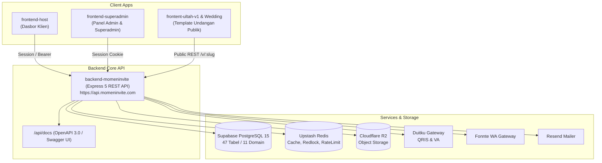
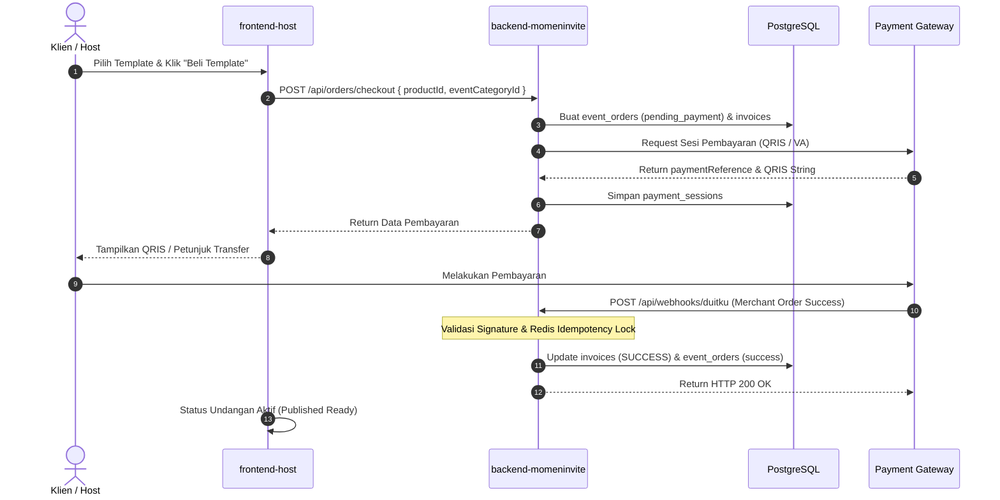
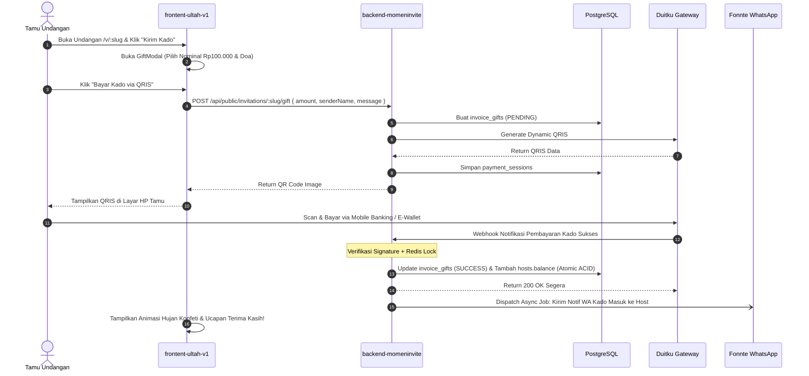
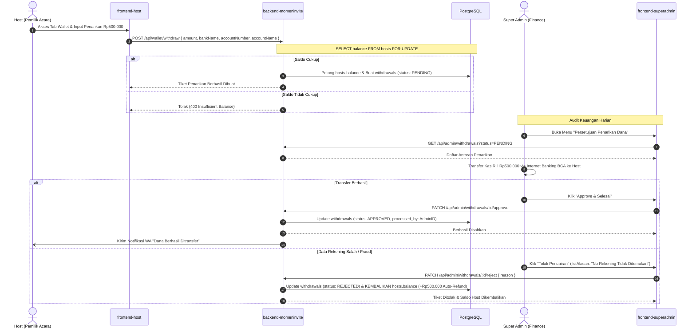
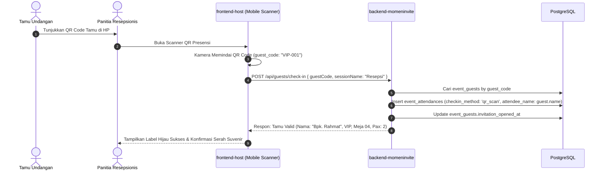
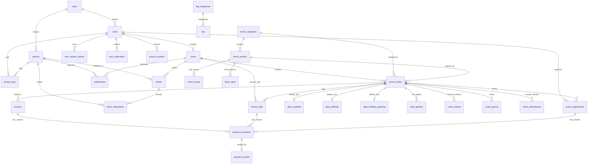

# PRD — Master Project Requirements Document (Global Ecosystem)

**Nama Proyek:** Momen Invite — SaaS Platform Undangan Digital & Social-Fintech Engine  
**Versi Dokumen:** 3.0 (Konsolidasi Master Global: Backend Express 5 + Frontend Host + Frontend Superadmin + Client Undangan Publik Ultah & Wedding + Skema Database v3 47 Tabel)  
**Status:** Dokumen Resmi Produksi (*Production Master PRD — Single Source of Truth*)  
**Lokasi File:** `backend-momeninvite/docs/PRD.md`  

---

## Daftar Isi

1. [Overview & Visi Produk](#1-overview--visi-produk)
2. [Ketentuan Umum Produk & Model Bisnis](#2-ketentuan-umum-produk--model-bisnis)
3. [Problem Statement](#3-problem-statement)
4. [Goals & Objectives](#4-goals--objectives)
5. [Target Users & Matriks Otorisasi RBAC](#5-target-users--matriks-otorisasi-rbac)
6. [User Stories Komprehensif](#6-user-stories-komprehensif)
7. [Global System Scope](#7-global-system-scope)
8. [Core Features & Arsitektur Modul Ekosistem](#8-core-features--arsitektur-modul-ekosistem)
   - 8.1 [Backend API Core Engine (`backend-momeninvite`)](#81-backend-api-core-engine-backend-momeninvite)
   - 8.2 [Dasbor Klien / Pembuat Undangan (`frontend-host`)](#82-dasbor-klien--pembuat-undangan-frontend-host)
   - 8.3 [Dasbor Administrator & Keuangan Platform (`frontend-superadmin`)](#83-dasbor-administrator--keuangan-platform-frontend-superadmin)
   - 8.4 [Template Publik Undangan Ulang Tahun (`frontent-ultah-v1`) & Wedding](#84-template-publik-undangan-ulang-tahun-frontent-ultah-v1--wedding)
9. [Functional Requirements (Spesifikasi Fungsional)](#9-functional-requirements-spesifikasi-fungsional)
10. [Non-Functional Requirements & Engineering Fundamentals](#10-non-functional-requirements--engineering-fundamentals)
11. [End-to-End User & Transaction Flows](#11-end-to-end-user--transaction-flows)
12. [Topologi Arsitektur & Deployment](#12-topologi-arsitektur--deployment)
13. [Database Schema v3 (Katalog 47 Tabel di 11 Domain)](#13-database-schema-v3-katalog-47-tabel-di-11-domain)
14. [Master Tech Stack Matrix](#14-master-tech-stack-matrix)
15. [Struktur Folder & Repositori Global](#15-struktur-folder--repositori-global)

---

## 1. Overview & Visi Produk

**Momen Invite** adalah ekosistem platform SaaS (*Software as a Service*) modern multi-tenant yang dirancang untuk pembuatan, penyesuaian (*customization*), distribusi, dan pengelolaan undangan digital interaktif multi-event (Pernikahan, Ulang Tahun Anak/Dewasa, *Birthday Greeting*, Khitanan, hingga Event Komunitas/Perusahaan).

Platform ini mengintegrasikan pengalaman undangan digital imersif dengan **Social-Fintech Digital Envelope (Amplop Kado Digital)** dan **Event Management & QR Check-in System**. 

Melalui ekosistem terpadu Momen Invite:
1. **Penyelenggara Acara (*Host*):** Dapat memilih katalog desain (*a-la-carte*), menyesuaikan tata letak seksi secara bebas (*drag-and-drop builder*), mengunggah aset foto/musik ke cloud storage berkinerja tinggi, mengelola buku tamu dan meja, melakukan scan QR presensi tamu pada hari H, serta mencairkan dana amplop kado digital (*cashout/withdrawal*) ke rekening bank pribadi.
2. **Tamu Undangan Publik (*Guest*):** Menikmati pengalaman undangan yang cepat, audio latar otomatis, animasi konfeti, surat interaktif, linimasa kenangan, galeri foto terfilter, pengisian ucapan/RSVP, serta kemudahan mengirim kado uang instan via QRIS Dinamis dan Virtual Account tanpa perlu menyalin nomor rekening bank manual.
3. **Pengelola Platform (*Admin & Super Admin*):** Mengelola katalog tema dan flash sale, memoderasi konten, meninjau pembayaran manual, menangani tiket bantuan pengguna, serta melakukan audit dan persetujuan pencairan saldo host secara ketat guna menjamin integritas keuangan kas riil platform.

---

## 2. Ketentuan Umum Produk & Model Bisnis

- **Topologi Ekosistem Decoupled Multi-Client:** Sistem memisahkan backend mandiri berbasis REST API (`backend-momeninvite`) dengan tiga aplikasi antarmuka klien:
  1. `frontend-host`: Panel dasbor pembuat undangan (*client-facing host portal*).
  2. `frontend-superadmin`: Panel dasbor operasional staf admin dan pemilik platform (*admin portal*).
  3. `frontent-ultah-v1` (+ template client lainnya): Antarmuka web publik template undangan interaktif untuk tamu.
- **Model Bisnis A-la-Carte & Flash Sale:** Pembelian produk undangan menggunakan model produk langsung per-tema (`event_product`) yang dikelompokkan dalam kategori acara (`event_categories`), didukung fitur diskon berbatas waktu (`flash_sales`), dengan opsi pembayaran otomatis via Duitku Gateway atau transfer manual via `bank_settings`.
- **Dukungan Multi-Event Polimorfik:** Desain database memisahkan data generik acara (`event_orders`) dengan tabel spesifik per kategori (`data_wedding`, `data_birthday`, `data_birthday_greeting`, `data_galeries`).
- **Sistem Amplop Digital Terpusat:** Dana kado dari tamu disalurkan via Payment Gateway (Duitku), masuk ke pembukuan kas platform, dan dikreditkan sebagai saldo virtual host (`hosts.balance`) yang dilindungi transaksi ACID dan mekanisme penguncian atomik (*Redlock / SELECT FOR UPDATE*).
- **Pencairan Dana Aman (Manual Approval Workflow):** Pencairan saldo dompet host (`withdrawals`) dieksekusi secara manual oleh `SUPER_ADMIN` setelah melakukan transfer kas riil ke rekening host, dengan fitur *auto-refund* seketika jika permohonan ditolak.
- **Perlindungan Data & Soft Deletes:** Menerapkan kolom `deleted_at TIMESTAMP NULL` pada seluruh entitas data operasional untuk audit trail dan pencegahan kehilangan data.
- **Penyimpanan Media Direct-to-Storage:** Upload foto resolusi tinggi dan audio streaming langsung diarahkan ke **Cloudflare R2** menggunakan pola *Pre-Signed URLs* (\$0 egress bandwidth fee).

---

## 3. Problem Statement

1. **Undangan Fisik Tidak Fleksibel & Mahal:** Biaya cetak tinggi, distribusi manual memakan waktu, dan tidak dapat diperbarui bila terjadi revisi tanggal atau lokasi acara.
2. **Keterbatasan Platform Konvensional (Wedding-Centric):** Sebagian besar platform undangan di pasar terkunci pada struktur pernikahan kaku (`groom_name`, `bride_name`), sehingga tidak relevan untuk perayaan ulang tahun personal, ucapan selamat sahabat, atau seminar perusahaan.
3. **Friksi Kado Tunai & Amplop Manual:** Tamu kesulitan mencari ATM atau menyalin nomor rekening manual; sementara pengantin/host kerepotan mencatat rekonsiliasi mutasi rekening bank pribadi satu per satu.
4. **Resiko Keamanan & Fraud Penarikan Uang:** Tanpa pemisahan wewenang (*separation of duties*), staf operasional berpotensi menyalahgunakan akses untuk mencairkan saldo kado ke rekening fiktif.
5. **Kerapuhan Sesi & Bottleneck Performa:** Penggunaan *in-memory session* menyebabkan user logout massal saat restart server; serta ketergantungan pada serverless cold-start rentan timeout saat lonjakan trafik kado di akhir pekan.

---

## 4. Goals & Objectives

### 4.1 Business Goals
- Membangun platform SaaS undangan digital terdepan di Indonesia dengan cakupan multi-event terlengkap (Pernikahan, Ulang Tahun, Perayaan Khusus).
- Menghasilkan pendapatan terukur dari penjualan produk undangan digital (`event_product`), *flash sale*, serta potensi skema biaya layanan amplop kado.
- Menjamin keamanan 100% sirkulasi dana amplop kado digital dari tamu hingga diterima di rekening bank host.
- Efisiensi biaya infrastruktur server melalui arsitektur persisten Node.js 24 LTS yang hemat sumber daya dan \$0 biaya egress media Cloudflare R2.

### 4.2 Product & Technical Goals
- **Backend Core:** RESTful API modular berbasis *package-by-feature* (11 domain) dengan dokumentasi interaktif Swagger/OpenAPI 3.0 di `/api/docs`.
- **Frontend Dasbor Klien:** Antarmuka responsif dengan login tanpa kata sandi (Passwordless OTP), drag-and-drop builder (`@dnd-kit`), upload media R2 langsung, serta QR check-in scanner di HP.
- **Frontend Super Admin:** Panel administrasi dengan *Role Guard* ketat, audit log penarikan dana, manajemen katalog produk/tema, dan sistem tiket dukungan terpadu.
- **Template Publik Imersif:** Client Next.js 16 App Router dengan animasi konfeti, audio stream R2, dynamic route `/v/[slug]`, dan modal pembayaran QRIS Duitku yang mulus.
- **Quality Gate Nol Bug:** Pipeline pengujian otomatis (gitleaks, ESLint security, npm audit, tsc, Vitest/Supertest) dengan target cakupan pengujian $\ge 70\%$ pada modul kritis.

---

## 5. Target Users & Matriks Otorisasi RBAC

Sistem menerapkan **Role-Based Access Control (RBAC)** dengan isolasi fisik tabel antara pengguna umum (`users`) dan staf pengelola (`admins`):

| Role | Persona | Akses & Wewenang | Metode Autentikasi | Sesi / Token |
|---|---|---|---|---|
| **`GUEST`** | Tamu Undangan Publik | Membuka undangan publik `/v/:slug`, memutar audio R2, submit RSVP & ucapan doa, bayar kado via QRIS/VA Duitku, registrasi event berbayar. | Stateless (Tanpa Login) / Registrasi User | Tanpa Sesi (Public) |
| **`HOST`** | Klien / Pembuat Undangan | Merancang undangan, atur seksi (@dnd-kit), upload media R2, kelola daftar tamu & meja, scan QR presensi, pantau saldo amplop, ajukan *withdrawal*, buka tiket support. | Passwordless Verification Code (Email / WhatsApp via `user_verification`) | JWT (Access + Refresh Token) & Cookie |
| **`ADMIN`** | Staf Operasional / Support | Moderasi katalog produk/tema, verifikasi bukti bayar manual, jawab tiket support (`ticket_interactions`), kelola pesan kontak, monitoring umum. | Email + Password Hash (`bcryptjs`) | Session Terpusat (`admin_sessions` via `connect-pg-simple`) |
| **`SUPER_ADMIN`** | Platform Owner / Finance | **Wewenang Eksklusif: Approve/Reject Penarikan Uang (Withdrawals)**, kelola rekening bank platform (`bank_settings`), master harga & flash sale, konfigurasi sistem global, audit logs. | Email + Password Hash (`bcryptjs`) + Superadmin Guard | Session Terpusat (`admin_sessions`) + Role Verification |

### Matriks Hak Akses Detail (RBAC Matrix)

```
Aksi Operasional                             GUEST    HOST      ADMIN    SUPER_ADMIN
────────────────────────────────────────────────────────────────────────────────────────
Akses Halaman Undangan Publik (/v/:slug)       ✅       ✅        ✅          ✅
Submit RSVP & Kirim Ucapan Doa                ✅       ✅        ✅          ✅
Kirim Amplop Kado Digital (Duitku QRIS)        ✅       ✅        ✅          ✅
Beli Produk Undangan / Checkout               ✅       ✅        ✅          ✅
CRUD Event Order & Konten Milik Sendiri        ❌    ✅ (Own)     ✅          ✅
Upload Media ke Cloudflare R2 (Presign)        ❌    ✅ (Own)     ✅          ✅
Kelola Daftar Tamu & Scan QR Presensi          ❌    ✅ (Own)     ✅          ✅
Cek Saldo Dompet & Request Withdrawal          ❌    ✅ (Own)     ❌          ❌
Persetujuan Pencairan Dana (Approve Cashout)   ❌       ❌        ❌       ✅ (Eksklusif)
Penolakan Pencairan Dana (Reject & Refund)     ❌       ❌        ❌       ✅ (Eksklusif)
Verifikasi Bukti Pembayaran Order Manual       ❌       ❌        ✅          ✅
CRUD Master Katalog Produk & Tema              ❌       ❌        ✅          ✅
Kelola Flash Sales & Promo                     ❌       ❌        ✅          ✅
Buka & Balas Tiket Dukungan (Support Desk)     ❌    ✅ (Own)  ✅ (Assigned)  ✅ (All)
Konfigurasi Sistem Global & Bank Platform      ❌       ❌        ❌          ✅
Akses Audit Activity Logs                      ❌       ❌        ❌          ✅
────────────────────────────────────────────────────────────────────────────────────────
```

---

## 6. User Stories Komprehensif

### 6.1 Host (Pembuat Acara)
- **US-H01:** Sebagai *Host*, saya ingin login tanpa kata sandi menggunakan kode OTP 6 digit ke email/WhatsApp agar praktis dan aman.
- **US-H02:** Sebagai *Host*, saya ingin memilih template undangan (Wedding, Birthday, Birthday Greeting) dan menyesuaikan isinya sesuai data perayaan saya.
- **US-H03:** Sebagai *Host*, saya ingin menyusun ulang urutan seksi undangan secara *drag-and-drop* dan menyembunyikan seksi yang tidak saya butuhkan.
- **US-H04:** Sebagai *Host*, saya ingin mengunggah foto galeri dan lagu pengiring langsung ke Cloudflare R2 dengan cepat.
- **US-H05:** Sebagai *Host*, saya ingin mengimpor daftar tamu dari file Excel, menghasilkan tautan personal unik per tamu, dan memindai QR code tamu di meja resepsionis pada hari H.
- **US-H06:** Sebagai *Host*, saya ingin memantau total saldo amplop kado yang masuk dari tamu secara real-time dan mengajukan penarikan dana ke rekening bank saya kapan saja.
- **US-H07:** Sebagai *Host*, saya ingin membuka tiket bantuan kepada admin jika mengalami kendala teknis atau pembayaran.

### 6.2 Tamu Undangan (Guest)
- **US-G01:** Sebagai *Tamu*, saya ingin membuka tautan undangan di ponsel dengan kecepatan loading instan, tampilan responsif, dan musik latar otomatis.
- **US-G02:** Sebagai *Tamu*, saya ingin membaca surat interaktif, melihat linimasa kenangan, memutar video/galeri foto, dan memberikan ucapan selamat.
- **US-G03:** Sebagai *Tamu*, saya ingin mengisi konfirmasi kehadiran (RSVP) beserta jumlah anggota keluarga yang hadir.
- **US-G04:** Sebagai *Tamu*, saya ingin mengirimkan kado uang digital secara mudah menggunakan scan QRIS (GoPay, OVO, BCA, Livin', ShopeePay) langsung di halaman undangan.

### 6.3 Admin & Super Admin
- **US-A01:** Sebagai *Admin*, saya ingin memoderasi katalog template desain, mengatur microcopy tema, dan mengonfigurasi aset default.
- **US-A02:** Sebagai *Admin*, saya ingin meninjau struk bukti transfer manual dari pemesan paket dan mengaktifkan pesanan mereka dengan satu klik.
- **US-A03:** Sebagai *Admin*, saya ingin merespons tiket bantuan dari host secara terpusat.
- **US-S01:** Sebagai *Super Admin*, saya ingin meninjau antrean permohonan penarikan dana host, melakukan transfer bank riil, lalu mengesahkan status transaksi menjadi `APPROVED`.
- **US-S02:** Sebagai *Super Admin*, saya ingin menolak permohonan penarikan yang tidak valid dengan alasan jelas, dan memastikan sistem secara otomatis mengembalikan saldo dompet host tanpa selisih.
- **US-S03:** Sebagai *Super Admin*, saya ingin mengatur konfigurasi gateway Duitku, Fonnte WhatsApp, Resend SMTP, rekening bank platform, dan memantau audit activity log.

---

## 7. Global System Scope

### 7.1 In-Scope
- **Arsitektur API Backend Mandiri (`backend-momeninvite`):** REST API berbasis Node.js 24 LTS, Express 5, TypeScript 6, dan Drizzle ORM yang mengelola 47 tabel di 11 domain.
- **Dasbor Host (`frontend-host`):** Portal klien berbasis Next.js/React dengan builder visual `@dnd-kit`, presign upload R2, scanner kamera QR check-in, dan wallet management.
- **Dasbor Admin (`frontend-superadmin`):** Panel administrasi berbasis Next.js/React dengan guard hak akses, audit withdrawal, manajemen order manual, master data produk, support ticket desk, dan CMS.
- **Template Undangan Publik (`frontent-ultah-v1` & Template Wedding):** Halaman publik Next.js 16 (App Router) dinamis `/v/[slug]` dengan integrasi audio R2, confetti, linimasa, galeri berkategori, RSVP, ucapan doa, dan modal pembayaran kado QRIS Duitku.
- **Sistem Pembayaran & Webhook Otomatis:** Integrasi Duitku API v2 (QRIS Dinamis, Virtual Account) dengan validasi signature HMAC dan proteksi idempotensi multi-layer.
- **Sistem Antrean & Log Notifikasi:** Integrasi Fonnte (WhatsApp) & Resend (Email) dengan penanganan retry exponential backoff dan Dead Letter Queue (`dead_notifications`).
- **Penyimpanan Media & Zero Egress:** Cloudflare R2 Object Storage terintegrasi via Pre-signed URL upload.
- **Keamanan & Kepatuhan:** Sesuai OWASP Top 10:2025, proteksi brute-force lockout, session hijacking prevention, rate limiting Upstash, dan kepatuhan UU PDP.
- **Testing & Quality Gate:** Pipeline CI/CD GitHub Actions dengan pengujian bertingkat (unit, integration, security audit).

### 7.2 Out-of-Scope
- Pemrosesan video streaming langsung (menggunakan embed YouTube / Vimeo).
- Payout otomatis tanpa campur tangan manusia (pencairan uang dilakukan transfer manual oleh Super Admin demi verifikasi kas riil dan kepatuhan audit perbankan).
- Aplikasi native mobile iOS/Android (diakomodasi penuh melalui Mobile Web PWA / responsif di browser HP).

---

## 8. Core Features & Arsitektur Modul Ekosistem



### 8.1 Backend API Core Engine (`backend-momeninvite`)
- **Struktur Package-by-Feature (11 Domain):**
  1. `auth`: Verifikasi OTP, refresh token, login admin, otorisasi RBAC.
  2. `host`: Profil host, pengaturan notifikasi WhatsApp, saldo dompet.
  3. `event_catalog`: Kategori event (`event_categories`), master produk template (`event_product`), aset default (`event_assets`).
  4. `event_order`: Pesanan undangan (`event_orders`), detail spesifik per event (`data_wedding`, `data_birthday`, `data_birthday_greeting`, `data_galeries`, `event_wishes`).
  5. `guest_attendance`: Buku tamu (`event_guests`), tiket event berbayar (`event_registrations`), log presensi fisik QR check-in (`event_attendances`).
  6. `billing_wallet`: Faktur pemesanan (`invoices`), sesi pembayaran gateway (`payment_sessions`, `payment_proofs`), amplop kado digital (`invoice_gifts`), permohonan penarikan dana (`withdrawals`), flash sales.
  7. `review`: Ulasan dan rating tema undangan (`invoice_reviews`).
  8. `ticket`: Sistem tiket bantuan teknis/billing (`tickets`, `ticket_interactions`).
  9. `notification`: Template notifikasi, log respons gateway (`response_whatsapps`, `response_emails`), dan antrean DLQ (`dead_notifications`).
  10. `cms_marketing`: Pop-up promo, tautan media sosial, FAQ, syarat & ketentuan, kebijakan privasi, pesan kontak.
  11. `system_config`: Pengaturan website & preferensi tema, konfigurasi transaksi, kredensial WhatsApp, SMTP, dan pop-up.

### 8.2 Dasbor Klien / Pembuat Undangan (`frontend-host`)
- **Passwordless Verification Portal:** Login aman via OTP email/WhatsApp tanpa membebani ingatan password pengguna.
- **Multi-Event Invitation Builder:** Form data terstruktur yang beradaptasi secara dinamis sesuai kategori acara yang dipilih.
- **Section Reorder & Visibility Control (@dnd-kit):** Antarmuka drag-and-drop untuk mengatur urutan 12+ seksi undangan secara visual, disimpan dalam payload JSON `event_orders.section_config`.
- **Pre-signed Media Uploader:** Upload langsung dari browser ke Cloudflare R2 tanpa melewati memory server Express.
- **Manajemen Tamu & Meja:** Form tamu individual, batch import via Excel (.xlsx), generator tautan personal (`?to=NamaTamu`), dan generator kartu QR code tamu.
- **Mobile QR Scanner Presensi:** Fitur kamera web/HP untuk memindai QR code tamu di meja resepsionis acara, mencatat kehadiran ke `event_attendances` secara instan.
- **Dompet Amplop Kado (Host Wallet):** Ringkasan saldo kado masuk, riwayat transaksi kado dari tamu, dan formulir pengajuan pencairan dana (*withdraw*).
- **Pusat Bantuan (Support Ticket Desk):** Mengirim tiket bantuan dan berinteraksi langsung dengan staf admin terkait masalah acara/pembayaran.

### 8.3 Dasbor Administrator & Keuangan Platform (`frontend-superadmin`)
- **Pemisahan Wewenang Berbasis Role:**
  - Staf `ADMIN`: Moderasi produk, peninjauan bukti transfer manual, pemrosesan tiket bantuan, moderasi ulasan.
  - `SUPER_ADMIN`: Wewenang tunggal untuk *Approval/Rejection* pencairan dana host, mutasi rekening bank platform, perubahan harga produk & flash sale, dan audit activity log.
- **Modul Audit Penarikan Dana (*Withdrawal Approval Console*):** Menampilkan antrean penarikan dana `PENDING`, detail rekening tujuan, verifikasi transfer kas riil, dan tombol eksekusi status `APPROVED` / `REJECTED` (disertai pengembalian saldo atomik).
- **Verifikasi Pembayaran Manual:** Preview bukti transfer bank (`payment_proofs`), verifikasi nominal, dan aktivasi pesanan undangan (`event_orders.status = 'success'`).
- **Master Data & Theme Catalog Manager:** CRUD produk tema (`event_product`), pengaturan microcopy default (`theme_config`), dan unggah aset tema (`event_assets`).
- **CMS & Legalitas Portal:** Editor landing page, banner pop-up promo, FAQ berstruktur kategori, dan halaman Syarat Ketentuan / Kebijakan Privasi.

### 8.4 Template Publik Undangan Ulang Tahun (`frontent-ultah-v1`) & Wedding
- **Next.js 16 App Router Dinamis:** Routing `/v/[slug]` dengan SSR dan Incremental Static Regeneration (ISR `revalidate = 60`).
- **Floating Header & Music Player (`useAudio`):** Navigasi mengambang dan pemutar musik latar otomatis dari Cloudflare R2 dengan status pemuatan *deferred* (tidak memblokir hydration browser).
- **Hero Section & Party Trigger (`useConfetti`):** Foto sampul resolusi tinggi, nama perayaan (`celebrant_name`), usia (`celebrant_age`), dan tombol pesta yang memicu animasi hujan konfeti.
- **Interactive Letter Envelope ("Surat untukmu"):** Dialog surat emosional interaktif dengan efek amplop terbuka (`letter_title`, `letter_salutation`, `letter_paragraphs`).
- **Linimasa Momen Kenangan:** Linimasa vertikal fase pertumbuhan atau momen berharga (`timeline_items` dari `data_birthday_greeting`).
- **Galeri Foto & Video Terfilter:** Tampilan galeri foto R2 dengan tab filter kategori dinamis (*"Semua", "Spesial", "Momen", "Jalan-jalan"*).
- **Buku Doa & Harapan Sahabat (`event_wishes`):** Daftar ucapan real-time dan formulir submit ucapan baru via `POST /api/public/invitations/:slug/wishes`.
- **Modal Amplop / Kado Digital Ultah (`GiftModal.tsx`):** Formulir pemberian kado uang dengan pilihan nominal cepat, integrasi Duitku QRIS dinamis real-time, dan notifikasi sukses beranimasi konfeti.

---

## 9. Functional Requirements (Spesifikasi Fungsional)

### 9.1 Autentikasi, Pengguna & Sesi (FR-AUTH)
- **FR-AUTH-01:** Host login melalui verifikasi kode OTP 6 digit (`user_verification`) dengan masa berlaku 5 menit.
- **FR-AUTH-02:** Admin dan Super Admin login menggunakan email dan password yang di-hash dengan `bcryptjs` (salt cost 12).
- **FR-AUTH-03:** Sesi Admin disimpan terpusat di tabel database `admin_sessions` menggunakan `connect-pg-simple` untuk mencegah *session drop* saat deploy ulang aplikasi.
- **FR-AUTH-04:** Sistem menerapkan *Brute-Force Lockout*: 5 kali kegagalan login berturut-turut pada akun admin mengunci akun selama 15 menit (`admins.failed_attempts` & `admins.locked_until`).
- **FR-AUTH-05:** Seluruh aksi krusial dicatat di tabel `activity_logs` (mencatat `actor_user_id` atau `actor_admin_id`, IP address, dan action descriptor).

### 9.2 Undangan, Konten Acara & Media (FR-INV)
- **FR-INV-01:** Sistem mendukung multi-event melalui relasi `event_orders` ke `event_categories` dan tabel spesifik (`data_wedding`, `data_birthday`, `data_birthday_greeting`).
- **FR-INV-02:** Urutan dan visibilitas seksi disimpan dalam format JSONB di kolom `event_orders.section_config`.
- **FR-INV-03:** Frontend mengunggah media langsung ke Cloudflare R2 via endpoint `POST /api/media/presign-upload` yang mengembalikan URL pre-signed S3.
- **FR-INV-04:** Halaman publik undangan `/v/:slug` dapat diakses oleh tamu umum (*stateless*), menampilkan data undangan lengkap sesuai izin publikasi (`is_published = true`).

### 9.3 Tamu, RSVP & Presensi QR (FR-GST)
- **FR-GST-01:** Host dapat mengelola data tamu di `event_guests` (nama, nomor WA, kategori VIP, nomor meja, batas pax).
- **FR-GST-02:** Tamu dapat mengirimkan konfirmasi kehadiran (`rsvp_status`, `rsvp_pax`, `rsvp_wishes`).
- **FR-GST-03:** Panitia/Host dapat memindai QR code tamu di lokasi acara untuk mencatat kehadiran ke tabel `event_attendances` (`checkin_method = 'qr_scan'`, pencatatan waktu aktual dan status suvenir).

### 9.4 Transaksi Finansial, Billing & Dompet (FR-FIN)
- **FR-FIN-01:** Sistem menghasilkan invoice pemesanan paket (`invoices`) dan invoice kado tamu (`invoice_gifts`) dengan integrasi sesi pembayaran Duitku (`payment_sessions`).
- **FR-FIN-02:** Webhook Duitku diproses secara idempotent dengan validasi signature MD5/HMAC dan *Redis Distributed Lock* (`SetNX`) untuk mencegah duplikasi kredit saldo.
- **FR-FIN-03:** Webhook kado yang sukses secara atomik menambah saldo dompet host (`hosts.balance`).
- **FR-FIN-04:** Pengajuan penarikan dana (`POST /api/wallet/withdraw`) memotong saldo host seketika dalam transaksi database dengan penguncian baris (`SELECT ... FOR UPDATE`) dan membuat tiket di tabel `withdrawals` berstatus `PENDING`.
- **FR-FIN-05:** Persetujuan penarikan (`PATCH /api/admin/withdrawals/:id/approve`) hanya dapat dilakukan oleh role `SUPER_ADMIN`, mengubah status menjadi `APPROVED`, mencatat nama & ID admin pengesah, dan memicu notifikasi WA ke host.
- **FR-FIN-06:** Penolakan penarikan (`PATCH /api/admin/withdrawals/:id/reject`) oleh Super Admin wajib menyertakan alasan (`reject_reason`) dan secara otomatis mengembalikan dana (*auto-refund*) ke `hosts.balance`.

### 9.5 Layanan Bantuan, Review & Ulasan (FR-SVC)
- **FR-SVC-01:** Host dapat membuat tiket bantuan (`tickets`) terkait kendala billing, teknis, atau desain.
- **FR-SVC-02:** Admin dapat menanggapi dan berdiskusi pada tiket via `ticket_interactions` hingga status tiket `resolved`.
- **FR-SVC-03:** Pengguna yang telah menyelesaikan pesanan dapat memberikan ulasan dan rating (1-5 bintang) di `invoice_reviews`.

### 9.6 Notifikasi, CMS & Konfigurasi Sistem (FR-SYS)
- **FR-SYS-01:** Pengiriman notifikasi WhatsApp (Fonnte) dan Email (Resend) diproses di latar belakang (*async queue*) dan dicatat di `response_whatsapps` serta `response_emails`.
- **FR-SYS-02:** Pesan yang gagal terkirim setelah 3 kali percobaan retry otomatis masuk ke Dead Letter Queue (`dead_notifications`).
- **FR-SYS-03:** Banner pop-up promo dikelola di `popups` dan frekuensinya diatur via `config_popup`.
- **FR-SYS-04:** Pengaturan website global, tema default, konfigurasi transaksi, dan kredensial gateway dikelola di tabel domain konfigurasi (`settings`, `config_transaction`, `config_whatsapp`, `config_smtp`).
- **FR-SYS-05 (Isolasi Indexing & SEO):** Seluruh halaman privat (dasbor host, panel admin, API endpoint) dan halaman undangan publik `/v/:slug` wajib mengirim header `X-Robots-Tag: noindex, nofollow, noarchive` (halaman undangan bersifat privat per link share). Hanya landing page marketing (`momeninvite.com`) yang di-index mesin pencari.

### 9.7 Standar Kualitas & Pengujian (FR-QA)
- **FR-QA-01 (Kontrak Respon Baku):** Seluruh respons API WAJIB mengembalikan format standar: `{ success: boolean, type: string, title: string, action: string, status: number, message: string, data: any, errors: any }`.
- **FR-QA-02 (Validasi Berlapis Zod):** Validasi backend Zod wajib mereplikasi aturan skema input; validasi frontend hanya berperan untuk UX.
- **FR-QA-03 (Rate Limiter Anti-Abuse):** Endpoint publik, login, request OTP, submit RSVP, dan kado dibatasi oleh `@upstash/ratelimit`; kegagalan melebihi ambang batas mengembalikan HTTP `429 Too Many Requests` beserta header `Retry-After`.
- **FR-QA-04 (Quality Gate CI/CD):** Tidak ada kode yang boleh di-merge ke branch `main` tanpa lolos gate GitHub Actions: Secret scanning (Gitleaks) $\rightarrow$ ESLint Security $\rightarrow$ NPM Audit High $\rightarrow$ Type Check (`tsc --noEmit`) $\rightarrow$ Vitest Unit & API Coverage ($\ge 70\%$).

---

## 10. Non-Functional Requirements & Engineering Fundamentals

- **NFR-01 (Konsistensi ACID Finansial):** Seluruh mutasi saldo dompet, checkout paket, dan penarikan dana wajib dieksekusi dalam transaksi database terisolasi dengan penguncian baris deterministik (*Deterministic Lock Ordering `ORDER BY id ASC`*) untuk mengeliminasi resiko *deadlock*.
- **NFR-02 (Strategi Indexing Database):** Indeks B-Tree wajib dipasang pada seluruh kolom ber-kardinalitas tinggi (`slug`, `guest_code`, `payment_reference`, `ticket_code`, `event_date`).
- **NFR-03 (Proteksi Data Soft Deletes):** Seluruh operasi penghapusan data pada entitas operasional menggunakan soft delete (`deleted_at = NOW()`), mengecualikan tabel sesi dan token kedaluwarsa.
- **NFR-04 (Performa & Caching Cerdas):** Data undangan publik di-cache di Upstash Redis dengan pola *Cache-Aside* dan invalidasi instan saat terjadi mutasi data oleh host.
- **NFR-05 (Resiliensi Integrasi Eksternal):** Pemanggilan API pihak ketiga (Duitku, Fonnte, Resend) wajib dibungkus batas waktu tegas (*AbortSignal timeout*) dan pemutus sirkuit (*Circuit Breaker* via `opossum`).
- **NFR-06 (Kepatuhan UU PDP & Sanitasi Log):** Data pribadi sensitif tamu (nomor telepon, alamat, pesan privat) tidak boleh dicatat mentah di log aplikasi (*Pino logger redaction*).
- **NFR-07 (Bebas Biaya Egress Media):** Distribusi aset media foto dan audio resolusi tinggi ditangani secara eksklusif oleh Cloudflare R2 CDN dengan biaya egress bandwidth \$0.

---

## 11. End-to-End User & Transaction Flows

### 11.1 Alur Pembelian Paket / Checkout Template (Host)



---

### 11.2 Alur Amplop Kado Digital Tamu (Public Template `frontent-ultah-v1`)



---

### 11.3 Alur Penarikan Dana Host & Audit Super Admin



---

### 11.4 Alur Presensi Hari H (QR Check-in Scanner)



---

## 12. Topologi Arsitektur & Deployment

Ekosistem Momen Invite di-deploy dengan model terisolasi:

```
                  ┌──────────────────────────────────────────────────────────┐
                  │                   Cloudflare Edge / DNS                  │
                  │   - SSL/TLS Termination (Universal SSL)                  │
                  │   - Static Asset Caching & WAF Protection                │
                  │   - Custom CDN Domain: cdn.momeninvite.com (R2)          │
                  └─────────────┬───────────────────────────────┬────────────┘
                                │                               │
              ┌─────────────────┴─────────────┐   ┌─────────────┴────────────┐
              │     Frontend Web Clusters     │   │     Backend API Engine   │
              │  (Vercel / Coolify / Node)    │   │  (cPanel Phusion / VPS)  │
              ├───────────────────────────────┤   ├──────────────────────────┤
              │ • momeninvite.com (Landing)   │   │ • api.momeninvite.com    │
              │ • app.momeninvite.com (Host)  │   │   - Node.js 24 LTS       │
              │ • admin.momeninvite.com       │   │   - Express 5 API        │
              │ • *.momeninvite.com/v/:slug   │   │   - Drizzle ORM Engine   │
              │   (frontent-ultah-v1 client)  │   │   - BullMQ / Cron Tasks  │
              └───────────────┬───────────────┘   └─────────────┬────────────┘
                              │                                 │
                              └────────────────┬────────────────┘
                                               │
               ┌───────────────────────────────┴──────────────────────────────┐
               │                  Cloud Infrastructure Layer                  │
               ├───────────────────────────────┬──────────────────────────────┤
               │ • Database: Supabase PG 15    │ • Object Storage: Cloudflare │
               │   (Connection Pooler Port)    │   R2 ($0 Egress Bandwidth)   │
               │ • Cache & Locks: Upstash Redis│ • Gateway: Duitku API v2     │
               │   (Serverless REST Protocol)  │ • Notifikasi: Fonnte & Resend│
               └───────────────────────────────┴──────────────────────────────┘
```

- **Backend Runtime:** Node.js 24 LTS dengan Express 5 berjalan stabil di bawah Phusion Passenger (cPanel) atau Docker Container persisten di Coolify VPS.
- **Continuous Integration / Continuous Delivery (CI/CD):** Pipeline GitHub Actions memvalidasi setiap Pull Request (SAST, Audit, TypeCheck, Unit Test), dilanjutkan trigger deployment otomatis ke server target.

---

## 13. Database Schema v3 (Katalog 47 Tabel di 11 Domain)

Seluruh entitas database dikonsolidasikan dalam **Skema v3** menggunakan Drizzle ORM dengan tipe data PostgreSQL murni:



### Rincian 47 Tabel per Domain:

1. **Domain 1: Identitas & Autentikasi (7 Tabel):**  
   `roles`, `users`, `user_refresh_tokens`, `user_verification`, `admins`, `admin_sessions`, `activity_logs`.
2. **Domain 2: Host / Penyelenggara (1 Tabel):**  
   `hosts` (menyimpan `balance`, `allow_notif_wa`, dan profil perbankan host).
3. **Domain 3: Katalog Acara & Tema (3 Tabel):**  
   `event_categories`, `event_product`, `event_assets`.
4. **Domain 4: Event Orders & Konten Acara Multi-Event (6 Tabel):**  
   `event_orders`, `data_wedding`, `data_birthday`, `data_birthday_greeting`, `data_galeries`, `event_wishes`.
5. **Domain 5: Tamu, Registrasi & Presensi (3 Tabel):**  
   `event_guests`, `event_registrations`, `event_attendances`.
6. **Domain 6: Billing, Transaksi Finansial & Dompet (6 Tabel):**  
   `invoices`, `payment_sessions`, `payment_proofs`, `invoice_gifts`, `withdrawals`, `flash_sales`.
7. **Domain 7: Review & Rating (1 Tabel):**  
   `invoice_reviews`.
8. **Domain 8: Layanan Bantuan / Dukungan (2 Tabel):**  
   `tickets`, `ticket_interactions`.
9. **Domain 9: Notifikasi, Log Gateway & DLQ (5 Tabel):**  
   `notif_whatsapps`, `response_whatsapps`, `notif_emails`, `response_emails`, `dead_notifications`.
10. **Domain 10: CMS, Marketing & Legalitas (8 Tabel):**  
    `popups`, `sosmed`, `faq_categories`, `faq`, `pages_terms`, `pages_privacy`, `landing_settings`, `contact_messages`.
11. **Domain 11: Konfigurasi Sistem Global (5 Tabel):**  
    `settings` (gabungan identitas web & preferensi), `config_transaction`, `config_whatsapp`, `config_smtp`, `config_popup`.

*(Lihat dokumentasi lengkap tipe kolom, indeks, dan atribut pada file `DATABASE-ERD.md`).*

---

## 14. Master Tech Stack Matrix

| Lapisan Sistem | Teknologi Terpilih | Versi | Peran & Justifikasi Arsitektur |
|---|---|---|---|
| **Backend Runtime** | Node.js (Active LTS) | `24.x` | Runtime performa tinggi, dukungan LTS hingga 2028, non-blocking asynchronous I/O. |
| **Backend Language** | TypeScript | `6.0.x` | Type safety ketat, mencegah kesalahan runtime, sinkronisasi skema Zod. |
| **Backend Framework**| Express | `5.x` | Routing modern, middleware matang, *native promise rejection handling*. |
| **ORM & Migrasi** | Drizzle ORM + `drizzle-kit`| Latest | SQL-first, type-safe query builder, tanpa reflection overhead berat. |
| **Database Utama** | PostgreSQL (Supabase) | `15.x / 16.x`| Transaksi ACID ketat, relasi data terstruktur, JSONB query support. |
| **Caching & Locking**| Upstash Redis | Serverless REST | REST-based stateless caching, Redlock mutasi saldo, sliding-window rate limiter. |
| **Media Storage** | Cloudflare R2 | S3-Compatible | Direct browser presigned upload, **\$0 biaya egress bandwidth streaming**. |
| **API Documentation**| Swagger UI + `zod-to-openapi`| OpenAPI 3.0 | Dokumentasi interaktif otomatis di `/api/docs` yang sinkron dengan skema Zod. |
| **Circuit Breaker** | Opossum | Latest | Melindungi server dari cascading failure saat gateway pihak ketiga lambat. |
| **Session Store** | `connect-pg-simple` | Latest | Penyimpanan sesi admin persisten di tabel `admin_sessions`. |
| **Frontend Host** | Next.js / Vite + React | `18 / 19` | Dasbor klien responsif, builder drag-and-drop `@dnd-kit`, TanStack Query & Table. |
| **Frontend Admin** | Next.js / Vite + React | `18 / 19` | Panel Super Admin & Staf, visualisasi analitik Recharts, shadcn/ui components. |
| **Frontend Ultah Client**| Next.js App Router | `16.2.1` | Template publik ulang tahun (`frontent-ultah-v1`), SSR dinamis, ISR 60s, Lucide React. |
| **Styling & UI Kit** | Tailwind CSS + `shadcn/ui`| PostCSS / v4 | Utilitas styling modern, komponen primitif Radix/Base UI yang aksesibel. |
| **Animasi & Interaksi**| Canvas Confetti + GSAP dan Frammer motion| Latest | Efek visual hujan konfeti, transisi kartu seksi emosional, audio player hook. |
| **Payment Gateway** | Duitku API | v2 | Integrasi QRIS Dinamis dan Virtual Account dengan validasi signature HMAC. |
| **Notifikasi Gateway**| Fonnte (WA) + Resend (Email)| REST API | Pengiriman notifikasi OTP, notifikasi kado masuk, dan peringatan withdrawal. |
| **Pengujian (Testing)**| Vitest + Supertest | Latest | Unit testing cepat, API contract testing, skenario OWASP Top 10 security testing. |

---

## 15. Struktur Folder & Repositori Global

Struktur direktori monorepo / workspace ekosistem Momen Invite:

```text
saas-undangan/
├── docs/                                      # Dokumentasi Desain & Arsitektur Frontend
│   ├── ARSITEKTUR-FRONTEND-ADMIN.md           # Blueprint Dasbor Host & Superadmin
│   └── ARSITEKTUR-FRONTEND-ULTAH.md           # Blueprint Template Ultah (frontent-ultah-v1)
│
├── frontent-ultah-v1/                         # Aplikasi Klien Template Undangan Ulang Tahun
│   ├── src/
│   │   ├── app/
│   │   │   ├── layout.tsx                     # Root Layout & Typography
│   │   │   └── v/[slug]/page.tsx              # Dynamic Public Route
│   │   ├── components/
│   │   │   ├── Header.tsx                     # Floating Navigation Bar
│   │   │   ├── HeroSection.tsx                # Hero Photo, Audio & Confetti Button
│   │   │   ├── LetterSection.tsx              # Interactive Envelope ("Surat Untukmu")
│   │   │   ├── TimelineSection.tsx            # Linimasa Momen Kenangan
│   │   │   ├── GallerySection.tsx             # Galeri Foto Terfilter R2
│   │   │   ├── WishesSection.tsx              # Buku Doa & Form Submit
│   │   │   ├── QuotesSection.tsx              # Kutipan Inspiratif
│   │   │   ├── GiftModal.tsx                  # Modal Amplop Kado QRIS Duitku
│   │   │   └── FinalSection.tsx               # Penutup & Ucapan Terima Kasih
│   │   ├── hooks/                             # useAudio, useConfetti, useScrollAnimation
│   │   └── types/                             # Tipe Data Undangan Ultah
│   └── next.config.ts                         # Konfigurasi Domain Gambar R2
│
├── backend-momeninvite/                       # Layanan REST API Mandiri
│   ├── docs/
│   │   ├── PRD.md                             # Master Global PRD (Dokumen Ini)
│   │   ├── DATABASE-ERD.md                    # Dokumentasi 47 Tabel & Kamus Data v3
│   │   ├── FUNDAMENTAL.md                     # 30 Pilar Resiliensi & Mitigasi Insiden
│   │   └── ARSITEKTUR-BACKEND.md              # Blueprint Backend Express 5 & Drizzle
│   │
│   ├── src/
│   │   ├── config/                            # Validasi ENV Zod, Duitku, S3 R2 Client
│   │   ├── db/
│   │   │   ├── client.ts                      # Koneksi Pool Supabase
│   │   │   └── schema/                        # Skema Drizzle 47 Tabel per Domain
│   │   │       ├── auth.schema.ts
│   │   │       ├── event.schema.ts
│   │   │       ├── billing.schema.ts
│   │   │       └── ...
│   │   ├── domains/                           # Package-by-Feature (Handler, Service, Repo, DTO)
│   │   │   ├── auth/                          # Login, OTP Verification, RBAC
│   │   │   ├── host/                          # Profil Host, Notif WA, Saldo
│   │   │   ├── event/                         # Katalog, Orders, Data Wedding/Ultah
│   │   │   ├── guest/                         # Tamu, RSVP, Presensi QR Check-in
│   │   │   ├── billing/                       # Invoices, Payment Duitku, Flash Sales
│   │   │   ├── wallet/                        # Saldo Dompet & Approval Withdrawal (ACID)
│   │   │   ├── ticket/                        # Sistem Bantuan & Interaksi Tiket
│   │   │   ├── review/                        # Rating & Ulasan Template
│   │   │   ├── notification/                  # WA Fonnte, Email Resend, Antrean DLQ
│   │   │   ├── cms/                           # Popups, Sosmed, FAQ, Syarat & Privasi
│   │   │   └── system/                        # Pengaturan Global Website & Transaksi
│   │   ├── middleware/                        # RBAC Guard, RateLimiter, ErrorHandler, Logger
│   │   ├── platform/                          # Adapter Duitku, Fonnte, Resend, S3 R2
│   │   ├── docs/                              # Registry Swagger OpenAPI 3.0 (/api/docs)
│   │   └── server.ts                          # Entry Point Server Express 5
│   │
│   ├── tests/                                 # Pengujian Sesuai Quality Gate
│   │   ├── unit/                              # Math Finansial, Helper, Skema Zod
│   │   ├── api/                               # Supertest RBAC, Webhook Idempotency, Flow Kado
│   │   └── security/                          # OWASP Top 10, IDOR, Rate Limiting 429
│   │
│   ├── .github/workflows/ci.yml               # Pipeline CI Quality Gate
│   ├── drizzle.config.ts                      # Konfigurasi Migrasi Drizzle Kit
│   └── package.json
│
└── AGENTS.md                                  # AI Master Operating Rules
```
